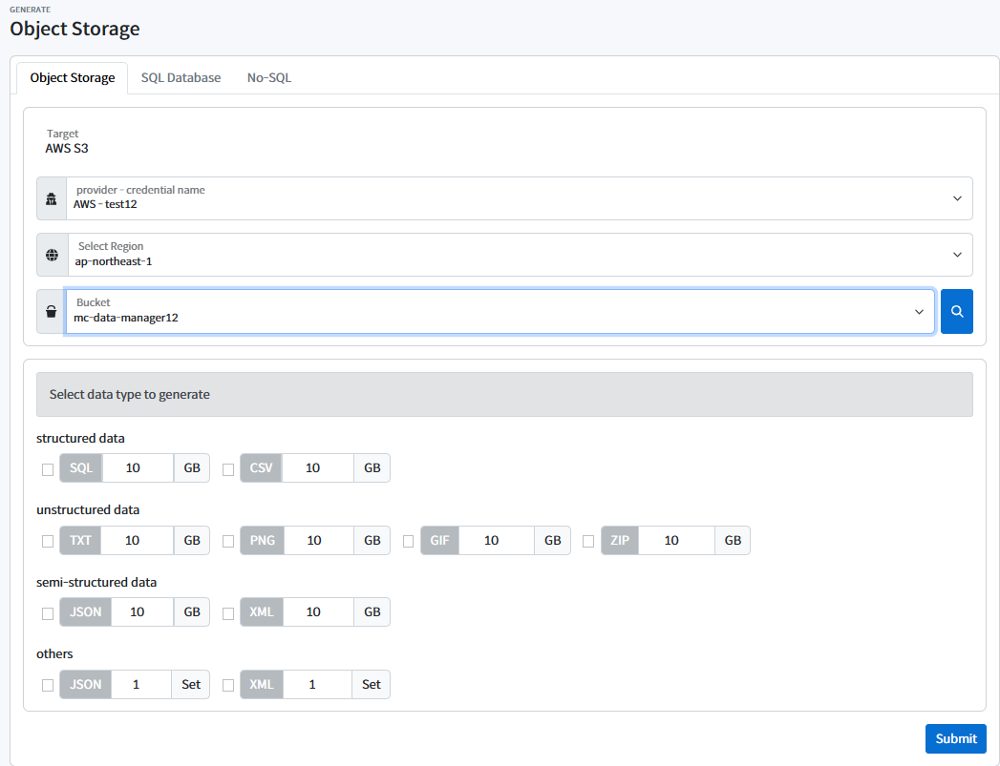
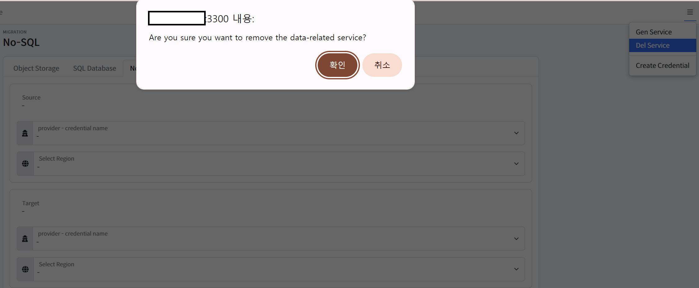

# Data Manager 사용 가이드

## 사전 준비 사항
### 스토리지/DB 관련 서비스 신청 및 권한 부여
* GCP, NCP같은 경우 서비스 이용 시 이용 신청을 해야한다.
* 로그인 후 사용할 서비스 페이지 접속 후 이용 신청을 하면 된다.
    * 예시

        **GCP**
        
        <p align="center"></p>

        <p align="center"></p>

        
        **NCP**
        
        <p align="center"></p>

* GCP와 NCP는 사전에 인증정보에 권한을 부여해야합니다.
  
    사용하고자 하는 서비스계정에 Storage Admin 권한 추가
    * GCP : 
      * https://cloud.google.com/storage../docs/access-control/iam-roles?hl=ko
      * https://console.cloud.google.com/apis/api/sqladmin.googleapis.com/
    
    서브 계정 사용 시 Object Storage 권한 추가
    * NCP : https://guide.ncloud-docs.com../docs/storage-objectstorage-subaccount

### CSP 인증정보
1. AWS 인증정보
    * [AWS S3, DynamoDB 인증정보](https:/../docs.aws.amazon.com/ko_kr/IAM/latest/UserGuide/id_credentials_access-keys.html#Using_CreateAccessKey)
2. GCP 인증정보
    * [GCP Cloud Storage, FirestoreDB 인증정보](https://developers.google.com/workspace/guides/create-credentials?hl=ko)
3. NCP 인증정보
    * [NCP Object Storage 인증정보](https://medium.com/naver-cloud-platform/%EC%9D%B4%EB%A0%87%EA%B2%8C-%EC%82%AC%EC%9A%A9%ED%95%98%EC%84%B8%EC%9A%94-%EB%84%A4%EC%9D%B4%EB%B2%84-%ED%81%B4%EB%9D%BC%EC%9A%B0%EB%93%9C-%ED%94%8C%EB%9E%AB%ED%8F%BC-%EC%9C%A0%EC%A0%80-api-%ED%99%9C%EC%9A%A9-%EB%B0%A9%EB%B2%95-1%ED%8E%B8-494f7d8dbcc3)

### AWS, GCP, NCP Cloud DB 메뉴얼 설치 및 인증정보
* [DB 설치 및 인증정보](../docs/Cloud-DB-Installation-and-Authentication-Information.md)

### 프로필 설정 가이드
* 위의 생성된 인증정보를 프로젝트의 루트디렉토리에 저장해야합니다.
    > ./profile.json
    ```json

    [
        {
            "profileName": "default",
            "credentials": {
                "aws": {
                    "accessKey": "",
                    "secretKey": ""
                },
                "ncp": {
                    "accessKey": "",
                    "secretKey": ""
                },
                "gcp": {
                    "type": "",
                    "project_id": "",
                    "private_key_id": "",
                    "private_key": "",
                    "client_email": "",
                    "client_id": "",
                    "auth_uri": "",
                    "token_uri": "",
                    "auth_provider_x509_cert_url": "",
                    "client_x509_cert_url": "",
                    "universe_domain": ""
                }
            }
        },
        {
            "profileName": "admin",
            "credentials": {
                "aws": {
                    "accessKey": "",
                    "secretKey": ""
                },
                "ncp": {
                    "accessKey": "",
                    "secretKey": ""
                },
                "gcp": {
                    "type": "",
                    "project_id": "",
                    "private_key_id": "",
                    "private_key": "",
                    "client_email": "",
                    "client_id": "",
                    "auth_uri": "",
                    "token_uri": "",
                    "auth_provider_x509_cert_url": "",
                    "client_x509_cert_url": "",
                    "universe_domain": ""
                }
            }
        }
    ]
    ```
* 아래의 명령어를 실행하여 프로필을 설정합니다.
  
  ```shell
  bash ./scripts/init-settings.sh
  ```


## 설치 및 사용 가이드
* [Data Manager 도커가이드](../docs/Datamanager-Docker-Guide.md)


## 1. 서비스 생성
1. 서비스 생성 요청을 한다.
   - 해당 요청 이후 약 20분 정도의 대기시간이 필요하다.
<p align="center"></p>

## 2. 오브젝트 스토리지
###  AWS S3 Generate
1. data-manager server 접속 후 좌측 메뉴에서 데이터 생성 -> Object Storage -> AWS S3 순으로 클릭
2. 사용자의 프로필과 리전 선택, 버킷 명을 입력한 다음 생성 할 데이터를 선택 및 용량 입력 후 생성 버튼 클릭

<p align="center"></p>

3. 성공 및 실패는 아래 로그에서 확인이 가능합니다.

<p align="center"></p>

###   Migrate from AWS S3 to NCP ObjectStorage 

1. data-manager server 접속 후 좌측 메뉴에서 Migration -> Object Storage  -> AWS s3 to -> Naver Object Storage
2. 사용자의 AWS 접속정보와 버킷명, 사용자의 Naver 접속정보와 버킷명을 입력 후 실행 버튼 클릭

<p align="center"></p>

3. 성공 및 실패는 아래 로그에서 확인이 가능합니다.

<p align="center"></p>

###   Backup NCP ObjectStorage 

1. data-manager server 접속 후 좌측 메뉴에서 Backup 클릭
2. Backup Service 항목에서 NCP, Objectstorage 선택
3. 사용자의 Naver 접속정보와 버킷명, 백업 경로 입력 후 백업 버튼 클릭

<p align="center"></p>

4. 성공 및 실패는 아래 로그에서 확인이 가능합니다.

<p align="center"></p>

###   Restore GCP ObjectStorage 

1. data-manager server 접속 후 좌측 메뉴에서  Restore 클릭
2. Restore Service 항목에서 GCP, Objectstorage 선택
3. 사용자의 GCP 접속정보와 버킷명, 복구 경로 입력 후 복구 버튼 클릭

<p align="center"></p>

4. 성공 및 실패는 아래 로그에서 확인이 가능합니다.

<p align="center"></p>

## 3. RDBMS
###  GCP RDBMS Generate
1. data-manager server 접속 후 좌측 메뉴에서 데이터 생성 -> SQL Database -> MySQL
2. 사용자의 DB Connect Config를 입력하고 생성 버튼 클릭

<p align="center"></p>

3. 성공 및 실패는 아래 로그에서 확인이 가능합니다.

<p align="center"></p>


###   Migrate from GCP to AWS 
1. data-manager server 접속 후 좌측 메뉴에서 MIGRATION -> SQL Database -> MySQL
2. 사용자의 DB Connect Config를 입력하고 실행 버튼 클릭

<p align="center"></p>

3. 성공 및 실패는 아래 로그에서 확인이 가능합니다.

<p align="center"></p>

###   Back Up AWS RDBMS 
1. data-manager server 접속 후 좌측 메뉴에서 Backup 클릭
2. Backup Service 항목에서 AWS, RDBMS 선택
3. 사용자의 DB Connect Config를 입력하고 실행 버튼 클릭

<p align="center"></p>

4. 성공 및 실패는 아래 로그에서 확인이 가능합니다.

<p align="center"></p>


###   Restore NCP RDBMS 

1. data-manager server 접속 후 좌측 메뉴에서  Restore 클릭
2. Restore Service 항목에서 NCP, RDBMS 선택
3. 사용자의 DB Connect Config를 입력하고 실행 버튼 클릭

<p align="center"></p>

4. 성공 및 실패는 아래 로그에서 확인이 가능합니다.

<p align="center"></p>

## 4. NRDBMS
###  AWS NRDBMS Generate
1. data-manager server 접속 후 좌측 메뉴에서 데이터 생성 -> NO-SQL Database -> Google Firestore
2. 사용자의 AWS 접속정보를 입력하고 생성 버튼 클릭

<p align="center"></p>

3. 성공 및 실패는 아래 로그에서 확인이 가능합니다.

<p align="center"></p>

###   Back Up AWS NRDBMS 
1. data-manager server 접속 후 좌측 메뉴에서 Backup 클릭
2. Backup Service 항목에서 AWS, NRDBMS 선택
3. 사용자의 DB Connect Config를 입력하고 실행 버튼 클릭

<p align="center"></p>

4. 성공 및 실패는 아래 로그에서 확인이 가능합니다.

<p align="center"></p>


###   Restore GCP NRDBMS 

1. data-manager server 접속 후 좌측 메뉴에서  Restore 클릭
2. Restore Service 항목에서 GCP, NRDBMS 선택
3. 사용자의 GCP 접속정보 입력 후 복구 버튼 클릭

<p align="center"></p>

4. 성공 및 실패는 아래 로그에서 확인이 가능합니다.

<p align="center"></p>


###   Migrate from GCP to AWS 
1. data-manager server 접속 후 좌측 메뉴에서 MIGRATION -> SQL Database -> MySQL
2. 사용자의 DB Connect Config를 입력하고 실행 버튼 클릭

<p align="center"></p>

3. 성공 및 실패는 아래 로그에서 확인이 가능합니다.

<p align="center"></p>


## 5. 서비스 삭제
1. 서비스 삭제 요청을 한다.
   - 해당 요청 이후 약 10분 정도의 대기시간이 필요하다.
<p align="center"></p>