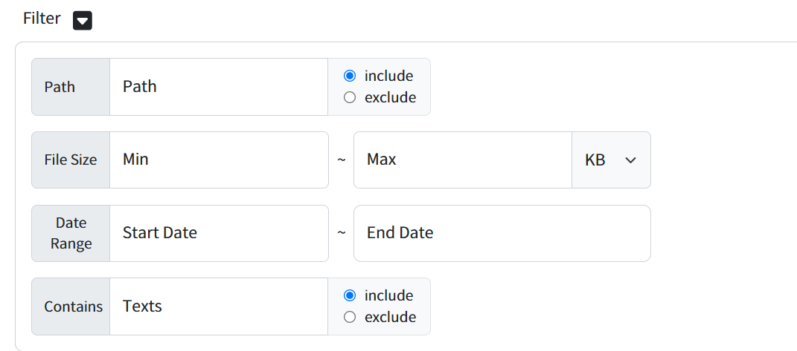

# Data Manager 사용 가이드

## 사전 준비 사항
### 스토리지/DB 관련 서비스 신청 및 권한 부여
* GCP, NCP같은 경우 서비스 이용 시 이용 신청을 해야한다.
* 로그인 후 사용할 서비스 페이지 접속 후 이용 신청을 하면 된다.
    * 예시

        **GCP**
        
        

        

        
        **NCP**
        
        

* GCP와 NCP는 사전에 인증정보에 권한을 부여해야합니다.
  
    사용하고자 하는 서비스계정에 Storage Admin 권한 추가
    * GCP : 
    
      <!-- * https://cloud.google.com/storage../docs/access-control/iam-roles?hl=ko -->
      * https://cloud.google.com/iam/docs/roles-permissions
      * https://console.cloud.google.com/apis/api/sqladmin.googleapis.com/
    
    서브 계정 사용 시 Object Storage 권한 추가
    * NCP : https://guide.ncloud-docs.com../docs/storage-objectstorage-subaccount

### CSP 인증정보
1. AWS 인증정보
    * [AWS S3, DynamoDB 인증정보](https:/../docs.aws.amazon.com/ko_kr/IAM/latest/UserGuide/id_credentials_access-keys.html#Using_CreateAccessKey)
2. GCP 인증정보
    * [GCP Cloud Storage, FirestoreDB 인증정보](https://developers.google.com/workspace/guides/create-credentials?hl=ko)
3. NCP 인증정보
    * [NCP Object Storage 인증정보](https://medium.com/naver-cloud-platform/%EC%9D%B4%EB%A0%87%EA%B2%8C-%EC%82%AC%EC%9A%A9%ED%95%98%EC%84%B8%EC%9A%94-%EB%84%A4%EC%9D%B4%EB%B2%84-%ED%81%B4%EB%9D%BC%EC%9A%B0%EB%93%9C-%ED%94%8C%EB%9E%AB%ED%8F%BC-%EC%9C%A0%EC%A0%80-api-%ED%99%9C%EC%9A%A9-%EB%B0%A9%EB%B2%95-1%ED%8E%B8-494f7d8dbcc3)

### AWS, GCP, NCP Cloud DB 메뉴얼 설치 및 인증정보
* [DB 설치 및 인증정보](../docs/Cloud-DB-Installation-and-Authentication-Information.md)

## 설치 및 사용 가이드
* [Data Manager 도커가이드](/docs/Datamanager-Install-Guide.md)

## 1. 오브젝트 스토리지
###  Dummy Data Generate
1. data-manager server 접속 후 상단 메뉴에서 데이터 생성 -> Object Storage 선택
2. Credential 과 리전 선택, 버킷을 선택 혹은 생성할 버킷명을 입력, 생성할 데이터를 선택 및 용량 입력 후 생성 버튼 클릭

3. 성공 및 실패는 아래 로그에서 확인이 가능합니다.

###   Migrate ObjectStorage 

1. data-manager server 접속 후 상단 메뉴에서 Migration -> Object Storage 선택
2. Source 의 Credential 정보 선택 -> 리전 선택 -> bucket 선택
3. Target 의 Credential 정보 선택 -> 리전 선택 -> 버킷 리스트 또는 새로 버킷 생성을 선택 후 "Submit" 버튼 클릭

- Filtering option 선택 시 선택된 조건에 해당하는 데이터가 "포함 또는 예외" 

4. 성공 및 실패는 아래 로그에서 확인이 가능합니다.

###   Backup ObjectStorage 

1. data-manager server 접속 후 상단 메뉴에서 Backup -> Object Storage 선택
2. Source 에서 credential 선택 -> 리전 선택 -> bucket 선택
3. Target에서 저장될 Path 입력

- Filtering option 선택 시 선택된 조건에 해당하는 데이터가 "포함 또는 예외" 

4. 성공 및 실패는 아래 로그에서 확인이 가능합니다.

###   Restore ObjectStorage 

1. data-manager server 접속 후 상단 메뉴에서 Restore 선택 -> Object Storage 선택
2. Source에서 data 가 저장된 path 입력
3. Target에서 credential 선택 -> 리전 선택 -> bucket 선택 후 "Submit" 클릭

4. 성공 및 실패는 아래 로그에서 확인이 가능합니다.

## 2. RDBMS
###  RDBMS Generate
1. data-manager server 접속 후 상단 메뉴에서 데이터 생성 -> SQL Database -> MySQL
2. 사용자의 DB Connect Config를 입력하고 생성 버튼 클릭

3. 성공 및 실패는 아래 로그에서 확인이 가능합니다.

###   Migrate RDBMS
1. data-manager server 접속 후 좌측 메뉴에서 MIGRATION -> SQL Database -> MySQL
2. 사용자의 Source DB Connect Config를 입력하고 Next 버튼 클릭

3. Source Mysql에 대한 현재 테이블 수 및 스레드 확인을 위한 진단 버튼 클릭(Optional)

4. 마이그레이션할 Target DB Connect Config를 입력하고 Next 버튼 클릭

5. Target Mysql에 대한 동적 성능 진단 시, 진단 버튼 클릭(Optional)

6. Submit 버튼 클릭 
7. 성공 및 실패는 아래 로그에서 확인이 가능합니다.

###   Back Up RDBMS 
1. data-manager server 접속 후 좌측 메뉴에서 Backup 클릭
2. Backup Service 항목에서 AWS, RDBMS 선택
3. 사용자의 DB Connect Config를 입력하고 실행 버튼 클릭

4. 성공 및 실패는 아래 로그에서 확인이 가능합니다.

###   Restore RDBMS 

1. data-manager server 접속 후 좌측 메뉴에서  Restore 클릭
2. Restore Service 항목에서 NCP, RDBMS 선택
3. 사용자의 DB Connect Config를 입력하고 실행 버튼 클릭

4. 성공 및 실패는 아래 로그에서 확인이 가능합니다.

## 3. NRDBMS
###  NRDBMS Generate
1. data-manager server 접속 후 좌측 메뉴에서 데이터 생성 -> NO-SQL Database -> Google Firestore
2. 사용자의 AWS 접속정보를 입력하고 생성 버튼 클릭

3. 성공 및 실패는 아래 로그에서 확인이 가능합니다.

###   Migrate from GCP to AWS 
1. data-manager server 접속 후 좌측 메뉴에서 MIGRATION -> SQL Database -> MySQL
2. 사용자의 DB Connect Config를 입력하고 실행 버튼 클릭

3. 성공 및 실패는 아래 로그에서 확인이 가능합니다.

###   Back Up AWS NRDBMS 
1. data-manager server 접속 후 좌측 메뉴에서 Backup 클릭
2. Backup Service 항목에서 AWS, NRDBMS 선택
3. 사용자의 DB Connect Config를 입력하고 실행 버튼 클릭

4. 성공 및 실패는 아래 로그에서 확인이 가능합니다.

###   Restore NRDBMS 

1. data-manager server 접속 후 좌측 메뉴에서  Restore 클릭
2. Restore Service 항목에서 GCP, NRDBMS 선택
3. 사용자의 GCP 접속정보 입력 후 복구 버튼 클릭

4. 성공 및 실패는 아래 로그에서 확인이 가능합니다.

