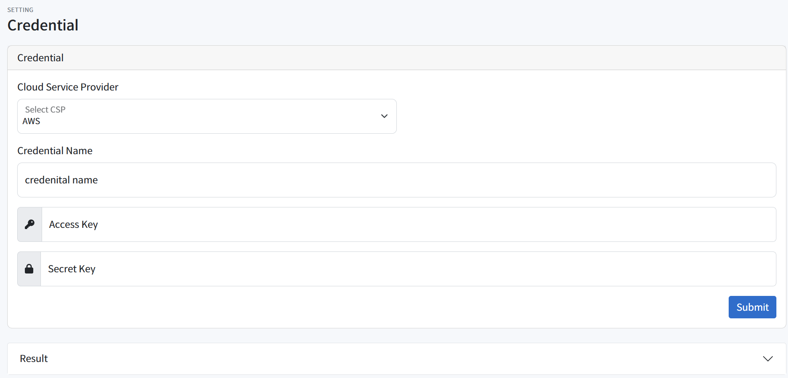
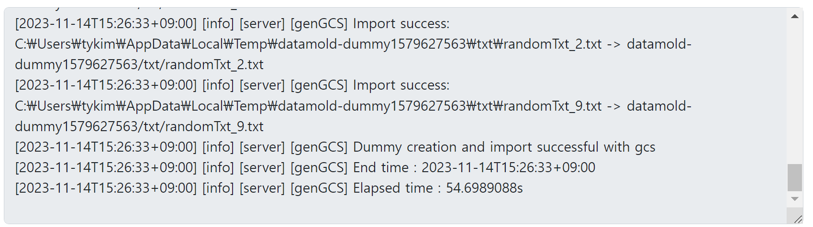
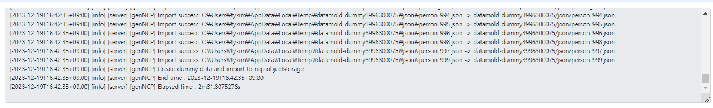

# Data Manager 사용 가이드

## 사전 준비 사항
### 스토리지/DB 관련 서비스 신청 및 권한 부여
* GCP, NCP같은 경우 서비스 이용 시 이용 신청을 해야한다.
* 로그인 후 사용할 서비스 페이지 접속 후 이용 신청을 하면 된다.
    * 예시

        **GCP**
        
        

        
        **NCP**
        
        

* GCP와 NCP는 사전에 인증정보에 권한을 부여해야합니다.
  
    사용하고자 하는 서비스계정에 Storage Admin 권한 추가
    * GCP : https://cloud.google.com/storage/docs/access-control/iam-roles?hl=ko
    
    서브 계정 사용 시 Object Storage 권한 추가
    * NCP : https://guide.ncloud-docs.com/docs/storage-objectstorage-subaccount

### CSP 인증정보
1. AWS 인증정보
    * [AWS S3, DynamoDB 인증정보](https://docs.aws.amazon.com/ko_kr/IAM/latest/UserGuide/id_credentials_access-keys.html#Using_CreateAccessKey)
2. GCP 인증정보
    * [GCP Cloud Storage, FirestoreDB 인증정보](https://developers.google.com/workspace/guides/create-credentials?hl=ko)
3. NCP 인증정보
    * [NCP Object Storage 인증정보](https://medium.com/naver-cloud-platform/%EC%9D%B4%EB%A0%87%EA%B2%8C-%EC%82%AC%EC%9A%A9%ED%95%98%EC%84%B8%EC%9A%94-%EB%84%A4%EC%9D%B4%EB%B2%84-%ED%81%B4%EB%9D%BC%EC%9A%B0%EB%93%9C-%ED%94%8C%EB%9E%AB%ED%8F%BC-%EC%9C%A0%EC%A0%80-api-%ED%99%9C%EC%9A%A9-%EB%B0%A9%EB%B2%95-1%ED%8E%B8-494f7d8dbcc3)

### AWS, GCP, NCP Cloud DB 설치 및 인증정보
* [DB 설치 및 인증정보](/docs/Cloud-DB-Installation-and-Authentication-Information.md)

### Credential 정보 등록
1. 상단 오른쪽에서 "Create Credential" 선택 후 이동

2. 등록을 원하는 CSP를 선택 후 관련 정보 입력 후 "Submit" 버튼 클릭
- AWS & NCP (name, access_key, secret_key info) 

- GCP (name, access_key, secret_key info, Credential Json info) 

- mc-data-manager에 등록 시, mc-infra-manager에도 credential 등록 요청을 보내며 해당 요청이 성공해야 mc-data-manager에도 등록됩니다.
  * 크레덴셜 등록 시, 아래 참고 링크와 같이 암호화되어 요청됩니다.
  * 참고: https://github.com/cloud-barista/cb-tumblebug/discussions/1773

3. 성공 및 실패는 아래 로그에서 확인 가능합니다.

## 1. 정형데이터 생성 및 마이그레이션
### 온프레미스(리눅스서버)에서 정형데이터 생성
1. data-manager server 접속 후 상단 메뉴에서 "Generate" 선택 -> Object Storage 선택 -> Gredential, Region, Bucket 선택 또는 create new bucket 선택

2. 생성 할 데이터를 선택 및 용량 입력 후 "Submit" 버튼 클릭

3. 성공 및 실패는 아래 로그에서 확인이 가능합니다.

## 2. 비정형데이터 생성 및 마이그레이션
### 온프레미스(리눅스서버)에서 비정형데이터 생성
1. data-manager server 접속 후 상단 메뉴에서 "Generate" 선택 -> Object Storage 선택 -> Gredential, Region, Bucket 선택 또는 create new bucket 선택

2. 생성 할 데이터를 선택 및 용량 입력 후 "Submit" 버튼 클릭

3. 성공 및 실패는 아래 로그에서 확인이 가능합니다.

## 3. 반정형데이터 생성 및 마이그레이션
### 온프레미스(리눅스서버)에서 반정형데이터
1.  data-manager server 접속 후 상단 메뉴에서 "Generate" 선택 -> Object Storage 선택 -> Gredential, Region, Bucket 선택 또는 create new bucket 선택

2. 생성 할 데이터를 선택 및 용량 입력 후 "Submit" 버튼 클릭

3. 성공 및 실패는 아래 로그에서 확인이 가능합니다.

## 4. 데이터 마이그레이션
<<<<<<< Updated upstream
* [Data Manager Demo Guide](../docs/Datamanager-Demo-Guide.md) 참고
=======
* [Data Manager Demo Guide](./Datamanager-Demo-Guide.md) 참고
>>>>>>> Stashed changes

