# Data Mold 기능 명세서

## 목차

- [사전 준비](#사전-준비)
- [Linux에서 설치 및 실행](#linux에서-설치-및-실행)
- [CLI 사용법](#cli-사용법)
  - [인증정보](#인증정보)
  - [명령어](#명령어)
- [Web Server 사용법](#web-server-사용법)
  - [데이터 생성](#데이터-생성)
  - [마이그레이션](#마이그레이션)

## 사전 준비

- linux (ubuntu 20.04) 대상
- [Golang 1.21.3](https://go.dev/dl/) 설치
- CSP별 인증 정보
  - [aws](https://docs.aws.amazon.com/ko_kr/IAM/latest/UserGuide/id_credentials_access-keys.html#Using_CreateAccessKey)
  - [gcp](https://developers.google.com/workspace/guides/create-credentials?hl=ko)
  - [ncp](https://medium.com/naver-cloud-platform/%EC%9D%B4%EB%A0%87%EA%B2%8C-%EC%82%AC%EC%9A%A9%ED%95%98%EC%84%B8%EC%9A%94-%EB%84%A4%EC%9D%B4%EB%B2%84-%ED%81%B4%EB%9D%BC%EC%9A%B0%EB%93%9C-%ED%94%8C%EB%9E%AB%ED%8F%BC-%EC%9C%A0%EC%A0%80-api-%ED%99%9C%EC%9A%A9-%EB%B0%A9%EB%B2%95-1%ED%8E%B8-494f7d8dbcc3)
- 사전 DB 설치 가이드
  - [aws rds mysql](https://luminitworld.tistory.com/94)
  - [gcp sql mysql](https://m.blog.naver.com/playhoos/221515020826)
  - [ncp mysql](https://guide.ncloud-docs.com/docs/clouddbformysql-start)
  - [ncp mongoDB](https://www.ncloud.com/guideCenter/guide/79)
## Linux에서 설치 및 실행

1. git을 이용한 datamold 설치
    
    ```bash
    # git 설치
    apt-get install git
    
    # 글로벌 설정
    git config --global user.name "자신의 계정"
    git config --global user.email "자신의 이메일"
    
    # git clone으로 datamold 가져오기
    git clone https://<자신의계정>@github.com/jjang-go/cm-data-mold.git
    # ex : git clone https://jjang-go@github.com/jjang-go/cm-data-mold.git
    
    # cm-data-mold로 이동
    cd ./cm-data-mold
    
    # datamold build
    go build .
    
    # 실행 확인
    ./cm-data-mold -h
    It is a tool that builds an environment for verification of data migration technology and 
    generates test data necessary for data migration.
    
    Usage:
      cm-data-mold [command]
    
    Available Commands:
      create      Creating dummy data of structured/unstructured/semi-structured
      delete      Delete dummy data
      export      Export dummy data from the service
      import      Import dummy data into the service
      migration   Migrate data to other csps
      server      Start Web Server
    
    Flags:
      -h, --help   help for cm-data-mold
    
    Use "cm-data-mold [command] --help" for more information about a command.
    ```
    

## CLI 사용법

### 인증정보

src : aws, dst : gcp로 구성된 인증정보 예시

```json
{
    "objectstorage": {
        "src": {
            "provider": "aws",
            "assessKey": "your-aws-accesskey",
            "secretKey": "your-aws-secretkey",
            "region": "aws-region-name",
            "bucketName": "aws-bucket-name"
        },
        "dst": {
            "provider": "gcp",
            "gcpCredPath": "gcp-credentials-file-path",
            "projectID": "gcp-projectid",
            "region": "gcp-region-name",
            "bucketName": "gcp-bucket-name"
        }
    },
    "rdbms": {
        "src": {
            "provider": "aws",
            "username": "rds-mysql-username",
            "password": "rds-mysql-password",
            "host": "rds-mysql-endpoint",
            "port": "rds-mysql-port"
        },
        "dst": {
            "provider": "gcp",
            "username": "sql-mysql-username",
            "password": "sql-mysql-password",
            "host": "sql-mysql-endpoint",
            "port": "sql-mysql-port"
        }
    },
    "nrdbms": {
        "src": {
            "provider": "aws",
            "assessKey": "your-aws-accesskey",
            "secretKey": "your-aws-secretkey",
            "region": "aws-region-name"
        },
        "dst": {
            "provider": "gcp",
            "gcpCredPath": "gcp-credentials-file-path",
            "projectID": "gcp-projectid",
            "region": "gcp-region-name"
        }
    }
}
```

src : aws, dst : ncp로 구성된 인증정보 예시

```json
{
    "objectstorage": {
        "src": {
            "provider": "aws",
            "assessKey": "your-aws-accesskey",
            "secretKey": "your-aws-secretkey",
            "region": "aws-region-name",
            "bucketName": "aws-bucket-name"
        },
        "dst": {
            "provider": "ncp",
            "assessKey": "your-ncp-accesskey",
            "secretKey": "your-ncp-secretkey",
            "region": "ncp-region-name",,
            "endpoint": "ncp-s3-endpoint",
            "bucketName": "ncp-bucket-name"
        }
    },
    "rdbms": {
        "src": {
            "provider": "aws",
            "username": "rds-mysql-username",
            "password": "rds-mysql-password",
            "host": "rds-mysql-endpoint",
            "port": "rds-mysql-port"
        },
        "dst": {
            "provider": "ncp",
            "username": "ncp-mysql-username",
            "password": "ncp-mysql-password",
            "host": "ncp-mysql-host",
            "port": "ncp-mysql-port"
        }
    },
    "nrdbms": {
        "src": {
            "provider": "aws",
            "assessKey": "your-aws-accesskey",
            "secretKey": "your-aws-secretkey",
            "region": "aws-region-name"
        },
        "dst": {
            "provider": "ncp",
            "username": "ncp-mongodb-username",
            "password": "ncp-mongodb-password",
            "host": "ncp-mongodb-host",
            "port": "ncp-mongodb-port",
            "databaseName": "ncp-mongodb-dbName"
        }
    }
}
```

### 명령어

1. create : 더미데이터 생성 명령어
    
    정형, 비정형, 반정형 데이터를 GB단위로 파일을 생성 가능합니다.
    
    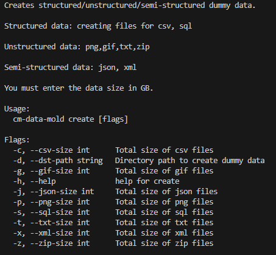
    
    ### 예시
    
    ```bash
    # example
    # /tmp/dummy 디렉토리에 sql 10GB, json 15GB, txt 100GB
    ./cm-data-mold create -s 10 -j 15 -t 100 -d /tmp/dummy
    
    # /tmp/dummyTemp 디렉토리에 csv 2GB, xml 4GB, zip 100GB
    ./cm-data-mold create -c 2 -x 4 -z 100 -d /tmp/dummyTemp
    ```
    

1. import : 더미데이터 import 명령어
    
    objectstorage, rdbms, nrdbms의 import하는 명령어입니다.
    
    각각의 subCommand를 선택하여 원하는 대상을 import합니다.
    
    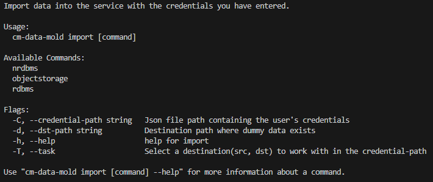
    
    1. objectstorage
        
        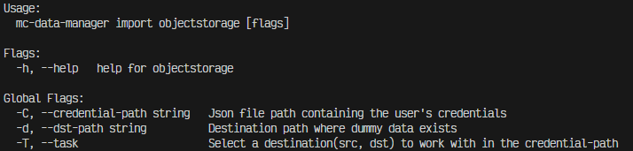
        
        ### 예시
        
        ```bash
        # example
        # 사용자 정보가 기재된 auth.json(src : aws, dst: gcp)을 활용하여 /tmp/dummy 디렉토리를 S3로 임포트
        ./cm-data-mold import objectstorage -C ./auth.json -d /tmp/dummy
        
        # 사용자 정보가 기재된 auth.json(src : aws, dst: gcp)을 활용하여 /tmp/dummy 디렉토리를 GCP로 임포트
        ./cm-data-mold import objectstorage -C ./auth.json -d /tmp/dummy -T
        ```
        
    2. rdbms
        
        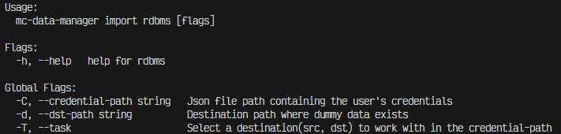
        
        ### 예시
        
        ```bash
        # example
        # 사용자 정보가 기재된 auth.json(src : aws, dst: gcp)을 활용하여 /tmp/dummy 디렉토리의 sql파일을 RDS msyql로 임포트
        ./cm-data-mold import rdbms -C ./auth.json -d /tmp/dummy
        
        # 사용자 정보가 기재된 auth.json(src : aws, dst: gcp)을 활용하여 /tmp/dummy 디렉토리의 sql파일을 SQL mysql로 임포트
        ./cm-data-mold import rdbms -C ./auth.json -d /tmp/dummy -T
        ```
        
    3. nrdbms
        
        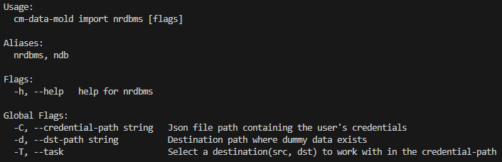
        
        ### 예시
        
        ```bash
        # example
        # 사용자 정보가 기재된 auth.json(src : aws, dst: gcp)을 활용하여 /tmp/dummy 디렉토리의 json파일을 AWS dynamoDB로 임포트
        ./cm-data-mold import nrdbms -C ./auth.json -d /tmp/dummy
        
        # 사용자 정보가 기재된 auth.son(src : aws, dst: gcp)을 활용하여 /tmp/dummy 디렉토리의 json파일을 GCP FirestoreDB로 임포트
        ./cm-data-mold import nrdbms -C ./auth.json -d /tmp/dummy -T
        ```
        
2. export : 더미데이터 export 명령어
    
    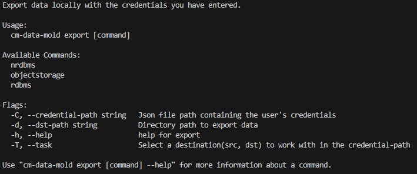
    
    1. objectstorage
        
        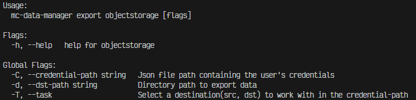
        
        ### 예시
        
        ```bash
        # example
        # 사용자 정보가 기재된 auth.json(src : aws, dst: gcp)을 활용하여 S3에서 /tmp/dummy 디렉토리로 익스포트
        ./cm-data-mold export objectstorage -C ./auth.json -d /tmp/dummy
        
        # 사용자 정보가 기재된 auth.json(src : aws, dst: gcp)을 활용하여 GCP에서 /tmp/dummy 디렉토리로 익스포트
        ./cm-data-mold export objectstorage -C ./auth.json -d /tmp/dummy -T
        ```
        
    2. rdbms
        
        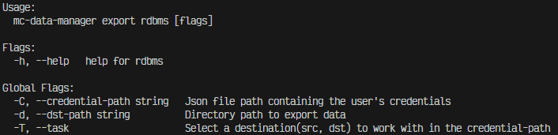
        
        ### 예시
        
        ```bash
        # example
        # 사용자 정보가 기재된 auth.json(src : aws, dst: gcp)을 활용하여 /tmp/dummy에 RDS msyql의 DB들을 익스포트
        ./cm-data-mold export rdbms -C ./auth.json -d /tmp/dummy
        
        # 사용자 정보가 기재된 auth.json(src : aws, dst: gcp)을 활용하여 /tmp/dummy에 SQL msyql의 DB들을 익스포트
        ./cm-data-mold export rdbms -C ./auth.json -d /tmp/dummy -T
        ```
        
    3. nrdbms
        
        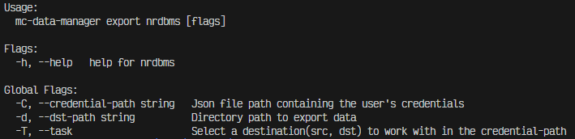
        
        ### 예시
        
        ```bash
        # example
        # 사용자 정보가 기재된 auth.json(src : aws, dst: gcp)을 활용하여 /tmp/dummy에 AWS dynamoDB의 테이블들을 json으로 익스포트
        ./cm-data-mold export nrdbms -C ./auth.json -d /tmp/dummy
        
        # 사용자 정보가 기재된 auth.son(src : aws, dst: gcp)을 활용하여 /tmp/dummy에 GCP FirestoreDB의 테이블들을 json으로 익스포트
        ./cm-data-mold export nrdbms -C ./auth.json -d /tmp/dummy -T
        ```
        
3. migration
    
    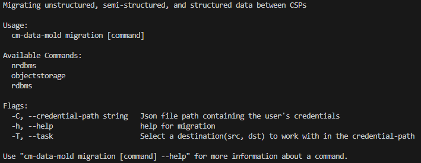
    
    1. objectstorage
        
        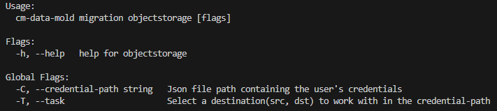
        
        ### 예시
        
        ```bash
        # example
        # 사용자 정보가 기재된 auth.json(src : aws, dst: gcp)을 활용하여 S3에서 GCP로 마이그레이션
        ./cm-data-mold migration objectstorage -C ./auth.json
        
        # 사용자 정보가 기재된 auth.json(src : aws, dst: gcp)을 활용하여 GCP에서 S3로 마이그레이션
        ./cm-data-mold migration objectstorage -C ./auth.json -T
        ```
        
    2. rdbms
        
        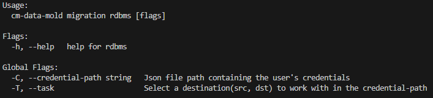
        
        ### 예시
        
        ```bash
        # example
        # 사용자 정보가 기재된 auth.json(src : aws, dst: gcp)을 활용하여 RDS Mysql에서 SQL Mysql로 마이그레이션
        ./cm-data-mold migration rdbms -C ./auth.json
        
        # 사용자 정보가 기재된 auth.json(src : aws, dst: gcp)을 활용하여 SQL Mysql에서 RDS Mysql로 마이그레이션
        ./cm-data-mold migration rdbms -C ./auth.json -T
        ```
        
    3. nrdbms
        
        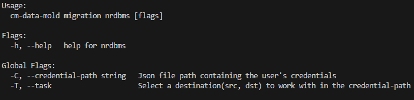
        
        ### 예시
        
        ```bash
        # example
        # 사용자 정보가 기재된 auth.json(src : aws, dst: gcp)을 활용하여 AWS dynamoDB에서 GCP FirestoreDB로 마이그레이션
        ./cm-data-mold migration nrdbms -C ./auth.json
        
        # 사용자 정보가 기재된 auth.son(src : aws, dst: gcp)을 활용하여 GCP FirestoreDB에서 AWS dynamoDB로 마이그레이션
        ./cm-data-mold migration nrdbms -C ./auth.json -T
        ```
        
4. delete
    
    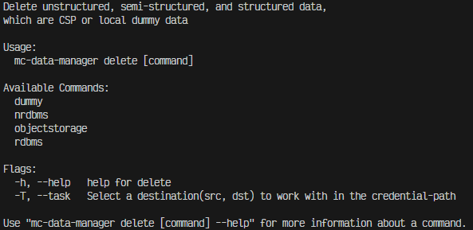
    
    1. dummy
        
        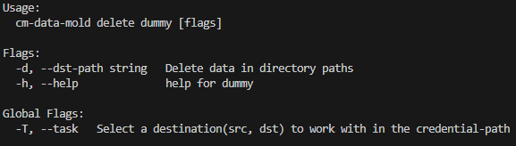
        
        ### 예시
        
        ```bash
        # example
        # 삭제하고자 하는 더미 폴더가 /tmp/dummy
        ./cm-data-mold delete dummy -d /tmp/dummy
        ```
        
    2. objectstorage
        
        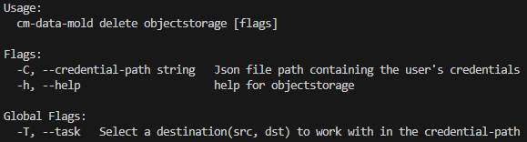
        
        ### 예시
        
        ```bash
        # example
        # 사용자 정보가 기재된 auth.json(src : aws, dst: gcp)을 활용하여 S3 버킷 삭제
        ./cm-data-mold delete objectstorage -C ./auth.json
        
        # 사용자 정보가 기재된 auth.json(src : aws, dst: gcp)을 활용하여 GCP 버킷 삭제
        ./cm-data-mold delete objectstorage -C ./auth.json -T
        ```
        
    3. rdbms
        
        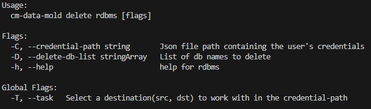
        
        ### 예시
        
        ```bash
        # example
        # 사용자 정보가 기재된 auth.json(src : aws, dst: gcp)을 활용하여 RDS Mysql의 adc,def DB 삭제
        ./cm-data-mold delete rdbms -C ./auth.json -D abc -D def
        
        # 사용자 정보가 기재된 auth.json(src : aws, dst: gcp)을 활용하여 SQL Mysql의 adc,def DB 삭제
        ./cm-data-mold delete rdbms -C ./auth.json -D abc -D def -T
        ```
        
    4. nrdbms
        
        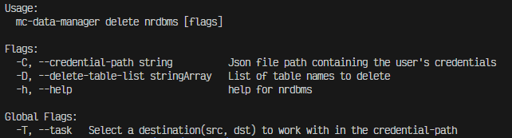
        
        ### 예시
        
        ```bash
        # example
        # 사용자 정보가 기재된 auth.json(src : aws, dst: gcp)을 활용하여 AWS DynamoDB의 adc,def 테이블 삭제
        ./cm-data-mold delete nrdbms -C ./auth.json -D abc -D def
        
        # 사용자 정보가 기재된 auth.json(src : aws, dst: gcp)을 활용하여 GCP FirestoreDB의 adc,def 콜렉션 삭제
        ./cm-data-mold delete nrdbms -C ./auth.json -D abc -D def -T
        ```
        
5. server
    
    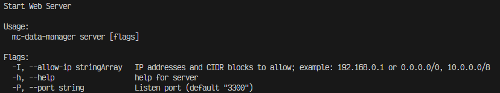
    
    ### 예시
    
    ```bash
    # example
    # datamold의 기능을 web으로도 사용할 수 있도록 하는 명령어입니다. (기본 포트 : 80)
    ./cm-data-mold server
    
    # 포트 변경도 가능합니다.
    ./cm-data-mold server -P 8080
    ```
    

## Web Server 사용법

./cm-data-mold server 명령어를 이용하여 서버를 이용할 수 있습니다.

메인화면

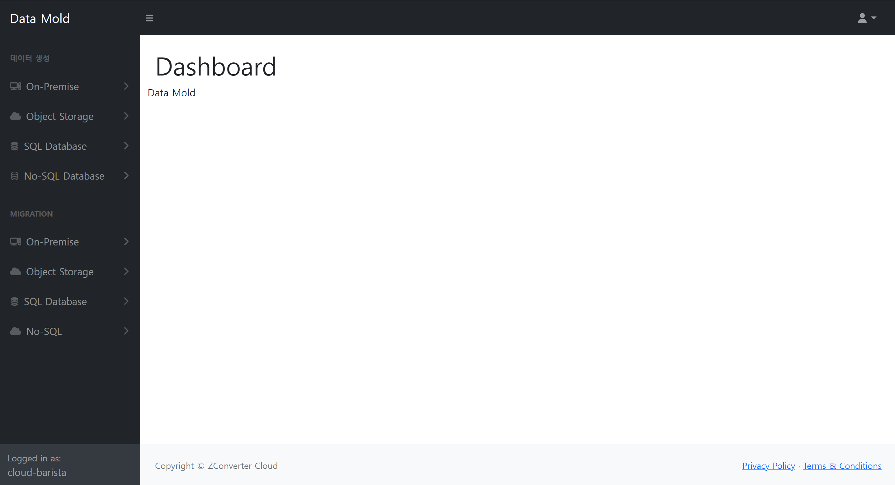

### 데이터 생성

1. On-Premise (Linux)
리눅스에 더미데이터를 생성하는 화면입니다.
    
    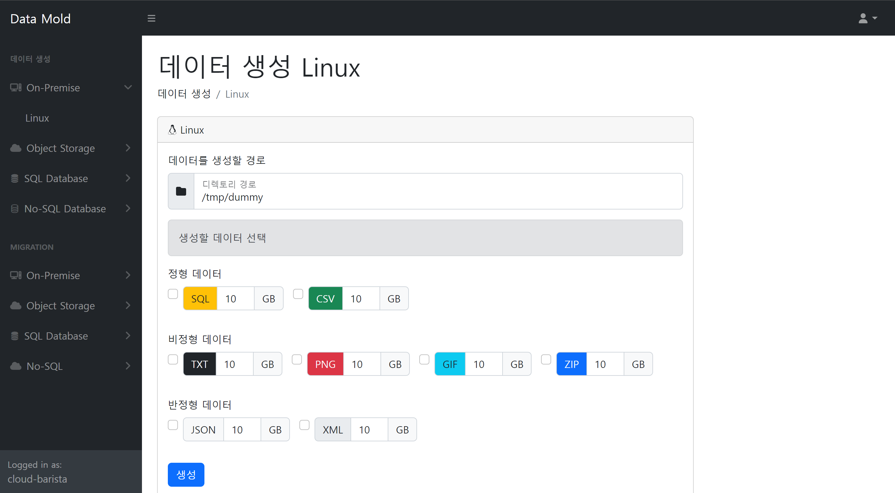
    
    directory 경로 입력 및 생성 할 데이터를 체크하고 GB단위의 용량을 선택하면 입력된 directory 경로에 데이터를 생성합니다.
    
    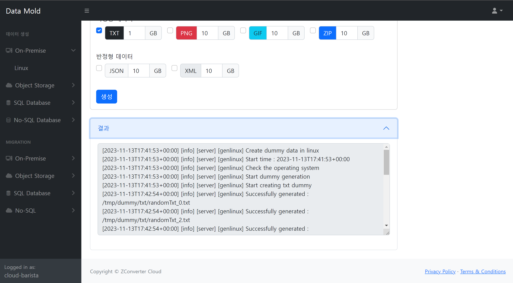
    
    directory에 요청한 데이터가 생성 완료 시 아래에서 결과로 로그를 표출합니다. 로그는 작업시간 및 작업내역이 출력되고 시작시간, 종료시간, 소요시간도 보여집니다.
    
2. S3
더미 데이터를 생성한 후 s3로 임포트하는 화면입니다.
    
    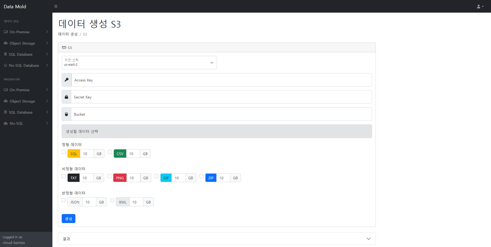
    
    AWS 인증정보를 활용하여 원하는 데이터를 s3로 생성할수있습니다. 생성 할 데이터를 체크하고 GB단위의 용량을 선택하면 생성 후 입력한 버킷을 생성하여 파일을 임포트 합니다.

    **AWS S3 인증정보 및 버킷**
    - AccessKey : AWS에서 발급한 AccessKey
    - SecretKey : AWS에서 발급한 SecretKey
    - Region : 이용할 AWS Region
    - Bucket : 생성 될 버킷 이름(DNS 호환성 규칙을 따라야 합니다.)
    
    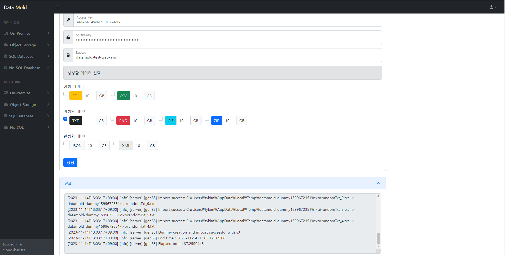
    
    임포트 완료되면 아래의 결과에 작업시간 및 작업내역을 로그를 보여줍니다.
    
3. GCP
    
    더미 데이터를 생성한 후 gcp cloud storage로 임포트하는 화면입니다.
    
    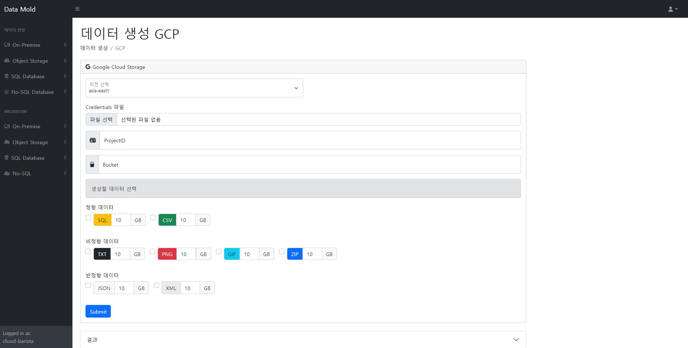
    
    GCP 인증정보를 활용하여 원하는 데이터를 Cloud Storage로 생성할수있습니다. 생성 할 데이터를 체크하고 GB단위의 용량을 선택하면 생성 후 입력한 버킷을 생성하여 파일을 임포트 합니다.
    
    **GCP Cloud Storage 인증정보 및 버킷**
    - Credentials : GCP에서 발급한 인증정보 json
    - ProjectID : GCP에서 이용할 프로젝트의 ID
    - Region : 이용할 GCP Region
    - Bucket : 생성 될 버킷 이름(DNS 호환성 규칙을 따라야 합니다.)
    
    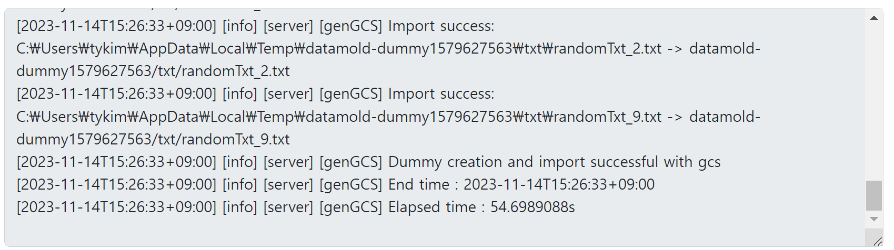
    
    임포트 완료되면 아래의 결과에 작업시간 및 작업내역을 로그를 보여줍니다.
    
4. NCP
    
    더미 데이터를 생성한 후 ncp object storage로 임포트하는 화면입니다.
    
    
    
    NCP 인증정보를 활용하여 원하는 데이터를 objectstorage로 생성할수있습니다. 생성 할 데이터를 체크하고 GB단위의 용량을 선택하면 생성 후 입력한 버킷을 생성하여 파일을 임포트 합니다.
    
    **NCP Object Storage인증정보 및 버킷**
    - AccessKey : NCP에서 발급한 AccessKey
    - SecretKey : NCP에서 발급한 SecretKey
    - Endpoint: 사용하고자하는 지역의 [Endpoint](https://api.ncloud-docs.com/docs/common-objectstorageapi-objectstorageapi) 입력
    - Region : 이용할 NCP Region
    - Bucket : 생성 될 버킷 이름(DNS 호환성 규칙을 따라야 합니다.)
    
    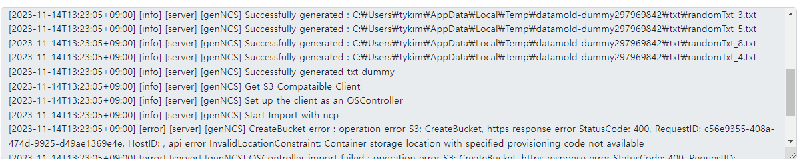
    
    임포트 완료되면 아래의 결과에 작업시간 및 작업내역을 로그를 보여줍니다.
    
5. mysql
    
    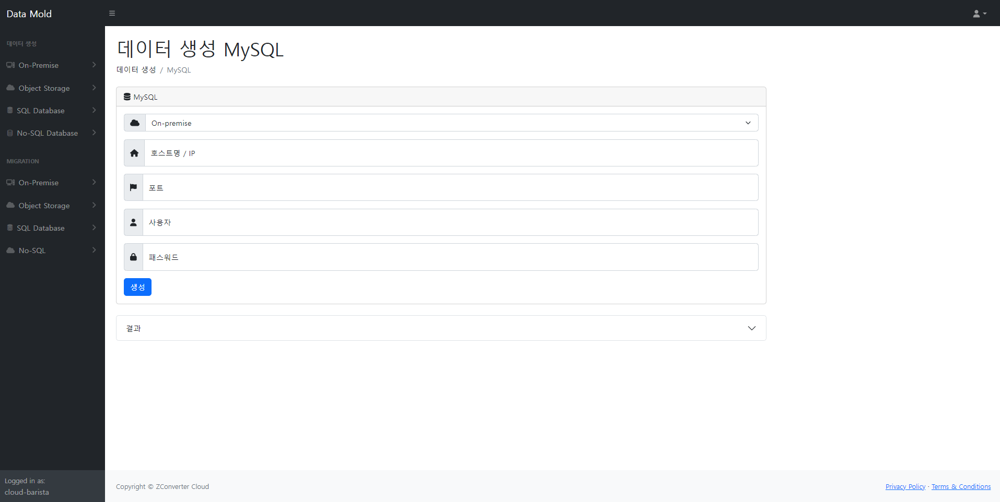
    
    mysql 접속정보를 이용하여 더미 sql문을 임포트합니다. 5개의 sql문 생성 후 임포트합니다.
    
    **On-Premise 인증정보**
    - On-Premise 선택
    - 호스트 명 / IP : On-Premise 호스트 입력
    - 포트 : On-Premise 포트 입력
    - 사용자 : On-Premise 접속 유저이름 입력
    - 패스워드 : 입력한 유저이름의 패스워드 입력
    
    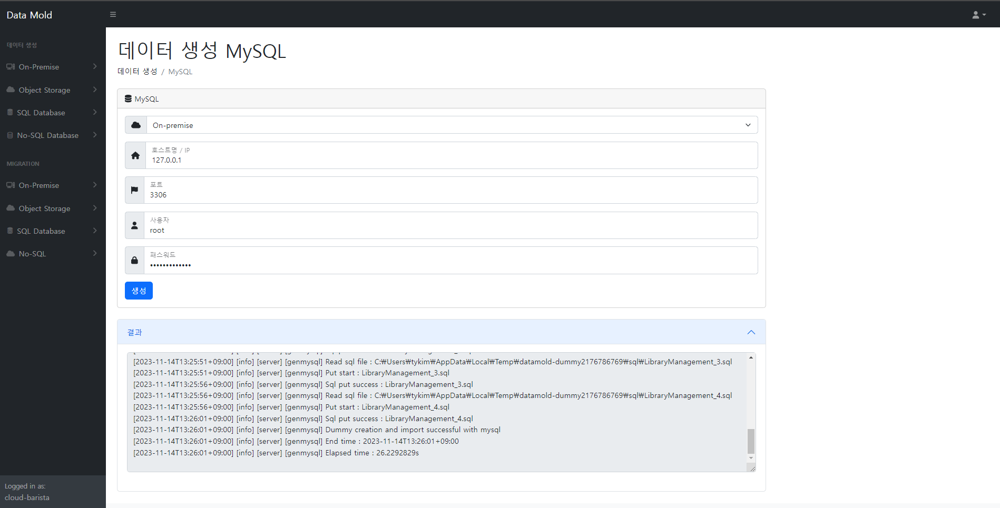
    
    임포트 완료되면 아래의 결과에 작업시간 및 작업내역을 로그를 보여줍니다.
    
    **AWS RDS mysql 인증정보**
    - AWS 선택
    - 호스트 명 / IP : RDS mysql 생성 시 얻은 공개 endpoint 입력
    - 포트 : RDS mysql 생성 시 얻은 포트 입력
    - 사용자 : RDS mysql 생성 시 설정한 유저이름 입력
    - 패스워드 : RDS mysql 생성 시 설정한 패스워드 입력
    
    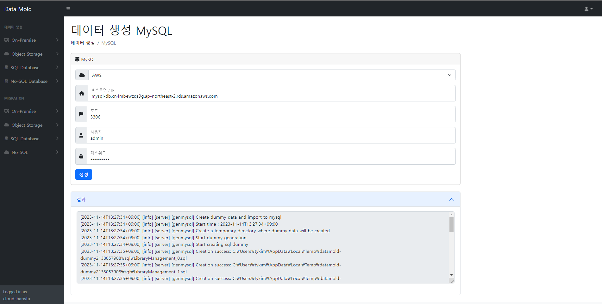
    
    임포트 완료되면 아래의 결과에 작업시간 및 작업내역을 로그를 보여줍니다.
    
    **GCP SQL mysql 인증정보**
    - GCP 선택
    - 호스트 명 / IP : SQL mysql 생성 시 얻은 공개 endpoint 입력
    - 포트 : SQL mysql 생성 시 얻은 포트 입력
    - 사용자 : SQL mysql 생성 시 설정한 유저이름 입력
    - 패스워드 : SQL mysql 생성 시 설정한 패스워드 입력
    
    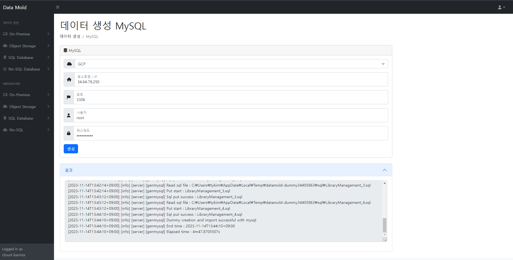
    
    임포트 완료되면 아래의 결과에 작업시간 및 작업내역을 로그를 보여줍니다.
    
    **NCP mysql 인증정보**
    - NCP 선택
    - 호스트 명 / IP : NCP mysql 생성 시 얻은 공개 endpoint 입력
    - 포트 : NCP mysql 생성 시 얻은 포트 입력
    - 사용자 : NCP mysql 생성 시 설정한 유저이름 입력
    - 패스워드 : NCP mysql 생성 시 설정한 패스워드 입력
    
    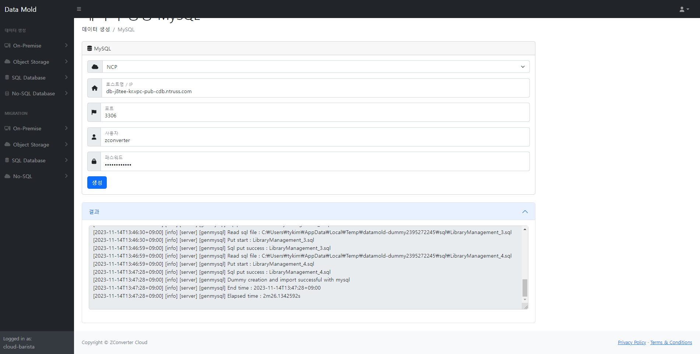
    
    임포트 완료되면 아래의 결과에 작업시간 및 작업내역을 로그를 보여줍니다.
    
6. AWS DynamoDB
    
    더미 데이터를 생성한 후 AWS DynamoDB로 임포트하는 화면입니다.
    
    
    
    AWS의 인증정보를 활용하여 DynamoDB에 더미 json파일을 임포트합니다. 7개의 json파일 생성 후 임포트합니다.
    
    **AWS DynamoDB 인증정보**
    - AccessKey : AWS에서 발급한 AccessKey
    - SecretKey : AWS에서 발급한 SecretKey
    - Region : 이용할 AWS Region
    
    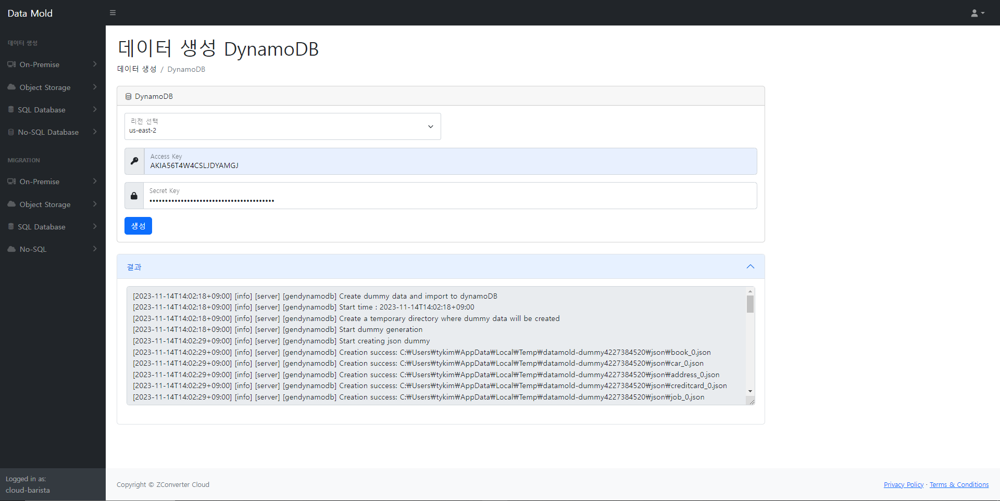
    
    임포트 완료되면 아래의 결과에 작업시간 및 작업내역을 로그를 보여줍니다.
    
7. GCP FirestoreDB
    
    더미 데이터를 생성한 후 GCP FirestoreDB로 임포트하는 화면입니다.
    
    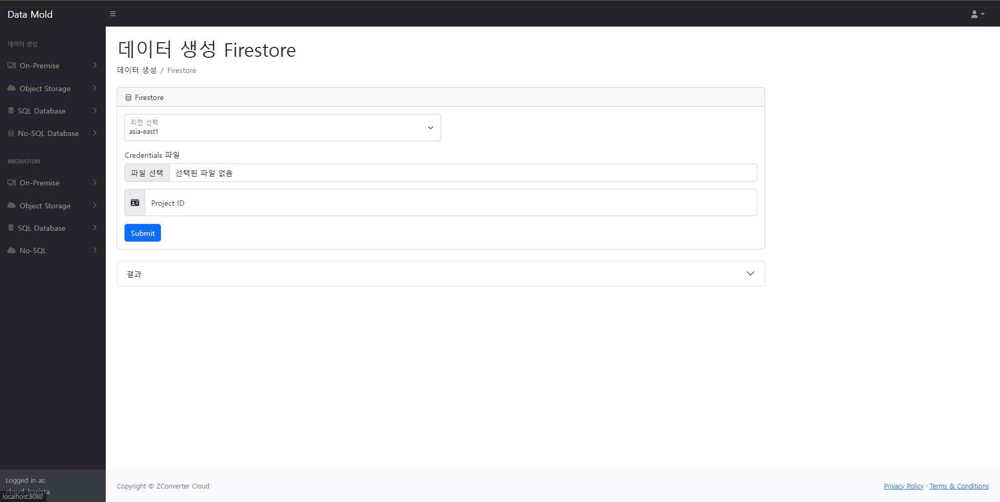
    
    GCP의 인증정보를 활용하여 FirestoreDB에 더미 json파일을 임포트합니다. 7개의 json파일 생성 후 임포트합니다.
    
    **GCP FirestoreDB 인증정보**
    - Credentials : GCP에서 발급한 인증정보 json
    - ProjectID : GCP에서 이용할 프로젝트의 ID
    - Region : 이용할 GCP Region
    
    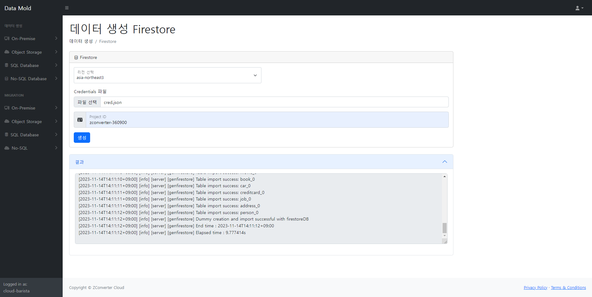
    
    임포트 완료되면 아래의 결과에 작업시간 및 작업내역을 로그를 보여줍니다.
    
8. NCP MongoDB
    
    더미 데이터를 생성한 후 GCP MongoDB로 임포트하는 화면입니다.
    
    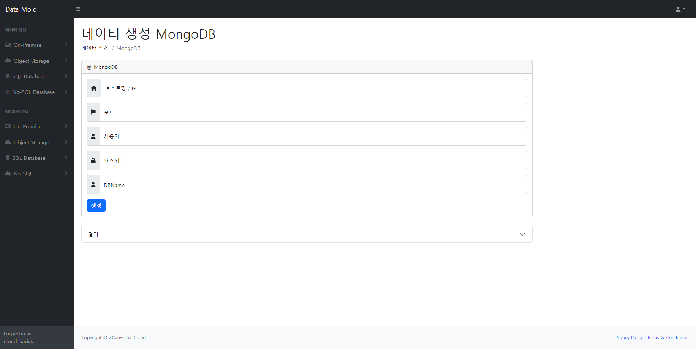
    
    NCP Cloud DB for MongoDB 생성 시 얻은 인증정보를 활용하여 MongoDB에 더미 json파일을 임포트합니다. 7개의 json파일 생성 후 임포트합니다.
    
    **NCP MongoDB 인증정보**
    - 호스트 명 / IP : NCP MongoDB 생성 시 얻은 공개 endpoint 입력
    - 포트 : NCP MongoDB 생성 시 얻은 포트 입력
    - 사용자 : NCP MongoDB 생성 시 설정한 유저이름 입력
    - 패스워드 : NCP MongoDB 생성 시 설정한 패스워드 입력
    - DBName : MongoDB에서 사용할 Database Name
    
    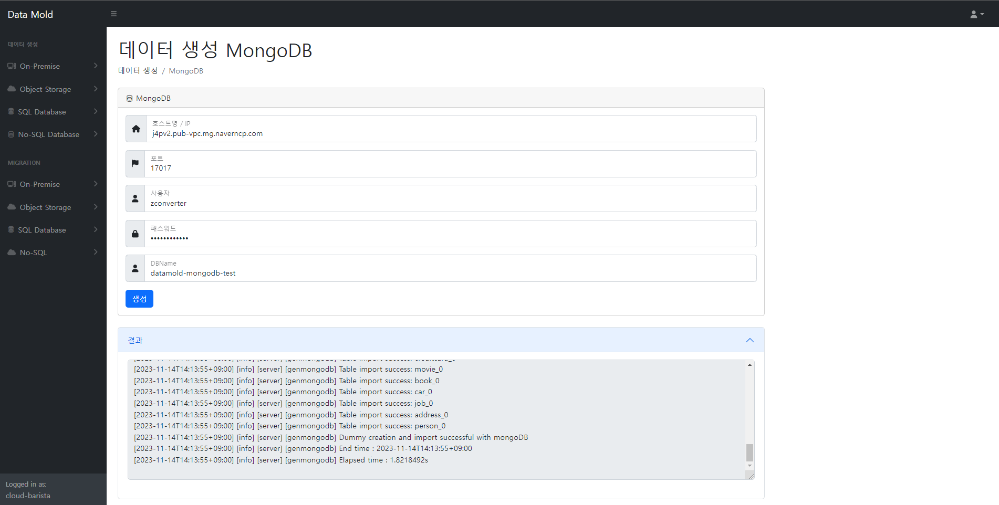
    
    임포트 완료되면 아래의 결과에 작업시간 및 작업내역을 로그를 보여줍니다.
    

### 마이그레이션

1. On-Premise (Linux) to AWS S3
    
    Linux의 데이터를 s3로 마이그레이션 하는 화면입니다.
    
    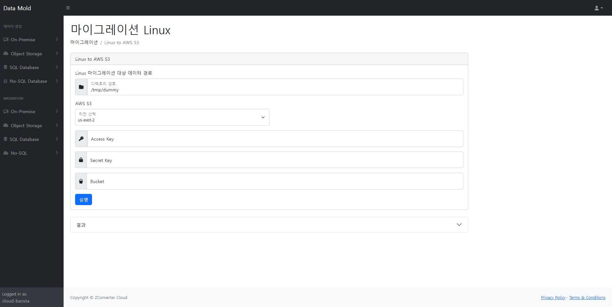
    
    마이그레이션 대상 경로 입력된 경로를 탐색하여 파일을 AWS의 인증정보를 이용하여 S3로 마이그레이션 합니다.
    
    **AWS S3 인증정보 및 버킷**
    - AccessKey : AWS에서 발급한 AccessKey
    - SecretKey : AWS에서 발급한 SecretKey
    - Region : 이용할 AWS Region
    - Bucket : 생성 될 버킷 이름(DNS 호환성 규칙을 따라야 합니다.)
    
    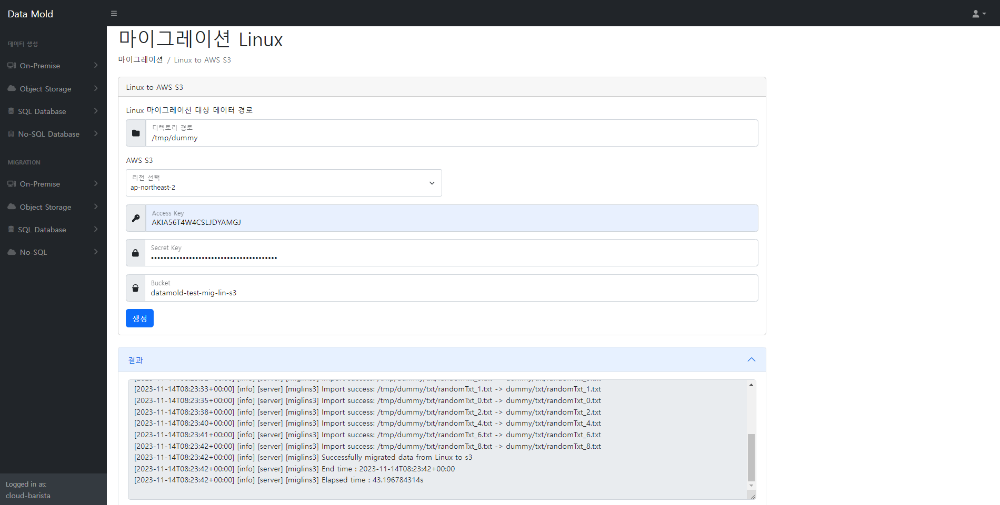
    
    임포트 완료되면 아래의 결과에 작업시간 및 작업내역을 로그를 보여줍니다.
    
2. On-Premise (Linux) to GCP
    
    Linux의 데이터를 gcp로 마이그레이션 하는 화면입니다.
    
    
    
    마이그레이션 대상 경로 입력된 경로를 탐색하여 파일을 GCP의 인증정보를 이용하여 GCP Cloud Storage로 마이그레이션 합니다.
    
    **GCP Cloud Storage 인증정보 및 버킷**
    - Credentials : GCP에서 발급한 인증정보 json
    - ProjectID : GCP에서 이용할 프로젝트의 ID
    - Region : 이용할 GCP Region
    - Bucket : 생성 될 버킷 이름(DNS 호환성 규칙을 따라야 합니다.)
    
    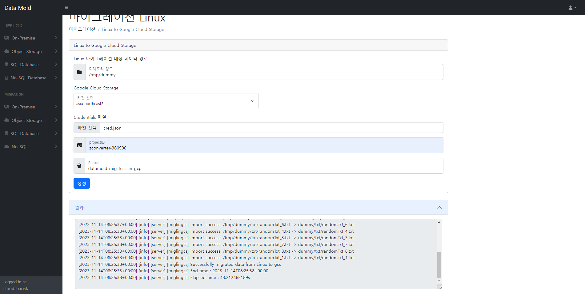
    
    임포트 완료되면 아래의 결과에 작업시간 및 작업내역을 로그를 보여줍니다.
    
3. On-Premise (Linux) to NCP
    
    Linux의 데이터를 ncp로 마이그레이션 하는 화면입니다.
    
    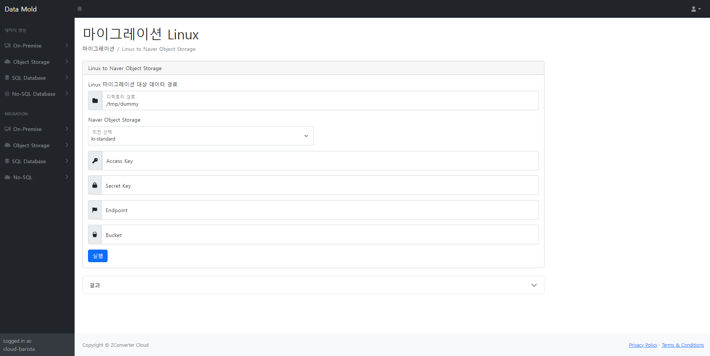
    
    마이그레이션 대상 경로 입력된 경로를 탐색하여 파일을 GCP의 인증정보를 이용하여 NCP Object Storage로 마이그레이션 합니다.
    
    **NCP Object Storage인증정보 및 버킷**
    - AccessKey : NCP에서 발급한 AccessKey
    - SecretKey : NCP에서 발급한 SecretKey
    - Endpoint: 사용하고자하는 지역의 [Endpoint](https://api.ncloud-docs.com/docs/common-objectstorageapi-objectstorageapi) 입력
    - Region : 이용할 NCP Region
    - Bucket : 생성 될 버킷 이름(DNS 호환성 규칙을 따라야 합니다.)
    
    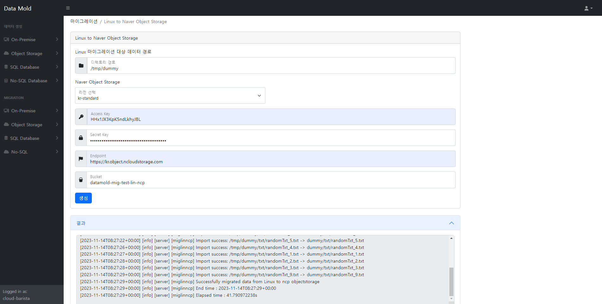
    
    임포트 완료되면 아래의 결과에 작업시간 및 작업내역을 로그를 보여줍니다.
    
4. AWS S3 to Linux
    
    AWS S3의 데이터를 Linux로 마이그레이션 하는 화면입니다.
    
    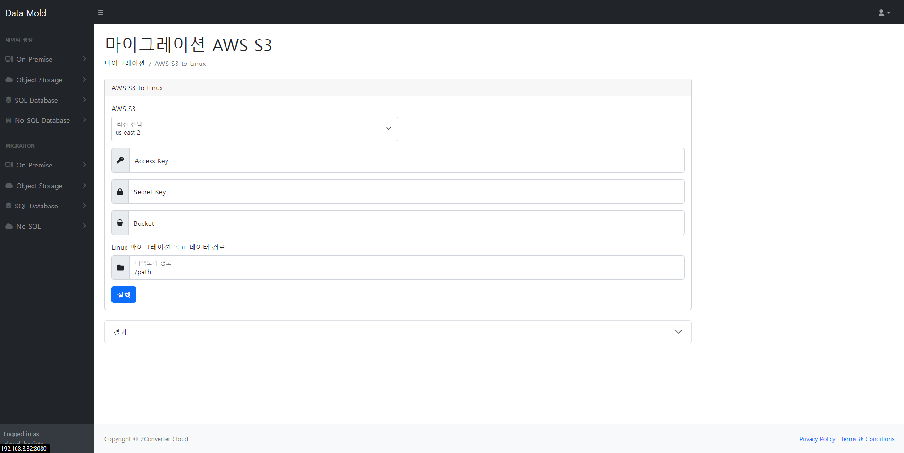
    
    마이그레이션 대상 경로 입력된 경로를 탐색과 S3의 오브젝트를 비교 후 변경사항 이 있는 파일을 AWS의 인증정보를 이용하여 Linux로 마이그레이션 합니다.
    
    **AWS S3 인증정보 및 버킷**
    - AccessKey : AWS에서 발급한 AccessKey
    - SecretKey : AWS에서 발급한 SecretKey
    - Region : 이용할 AWS Region
    - Bucket : 마이그레이션 소스 버킷 이름(DNS 호환성 규칙을 따라야 합니다.)
    
    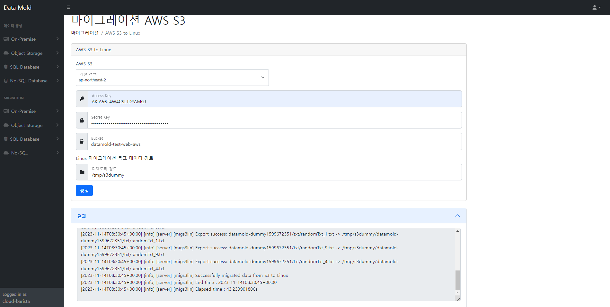
    
    임포트 완료되면 아래의 결과에 작업시간 및 작업내역을 로그를 보여줍니다.
    
5. AWS S3 to GCP
    
    AWS S3의 데이터를 GCP Cloud Storage로 마이그레이션 하는 화면입니다.
    
    
    
    S3의 버킷 내 오브젝트와 GCP의 오브젝트를 비교 후 변경사항 이 있는 파일을 AWS의 인증정보와 GCP의 인증정보를 이용하여 AWS S3에서 GCP Cloud Storage로 마이그레이션 합니다.
    
    **AWS S3 인증정보 및 버킷**
    - AccessKey : AWS에서 발급한 AccessKey
    - SecretKey : AWS에서 발급한 SecretKey
    - Region : 이용할 AWS Region
    - Bucket : 마이그레이션 소스 버킷 이름(DNS 호환성 규칙을 따라야 합니다.)
    
    **GCP Cloud Storage 인증정보 및 버킷**
    - Credentials : GCP에서 발급한 인증정보 json
    - ProjectID : GCP에서 이용할 프로젝트의 ID
    - Region : 이용할 GCP Region
    - Bucket : 마이그레이션 타겟 버킷 이름(DNS 호환성 규칙을 따라야 합니다.)
    
    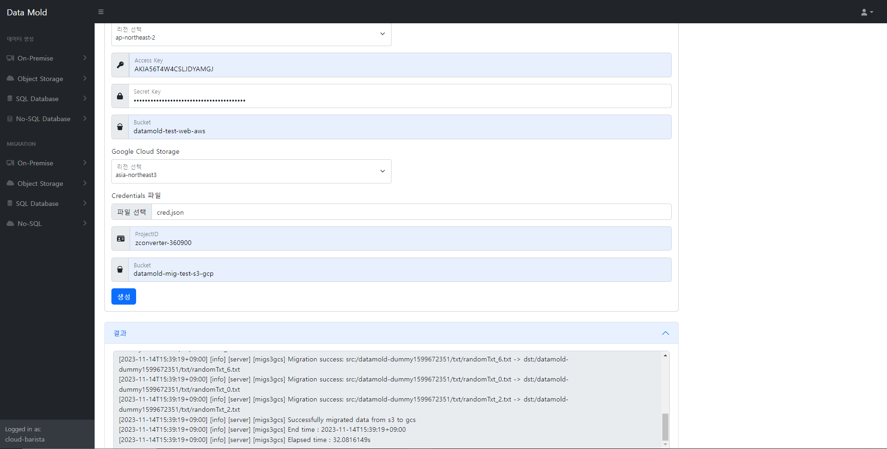
    
    임포트 완료되면 아래의 결과에 작업시간 및 작업내역을 로그를 보여줍니다.
    
6. AWS S3 to NCP
    
    AWS S3의 데이터를 NCP Object Storage로 마이그레이션 하는 화면입니다.
    
    
    
    S3의 버킷 내 오브젝트와 NCP의 오브젝트를 비교 후 변경사항 이 있는 파일을 AWS의 인증정보와 NCP의 인증정보를 이용하여 AWS S3에서 NCP Object Storage로 마이그레이션 합니다.
    
    **AWS S3 인증정보 및 버킷**
    - AccessKey : AWS에서 발급한 AccessKey
    - SecretKey : AWS에서 발급한 SecretKey
    - Region : 이용할 AWS Region
    - Bucket : 마이그레이션 소스 버킷 이름(DNS 호환성 규칙을 따라야 합니다.)
    
    **NCP Object Storage인증정보 및 버킷**
    - AccessKey : NCP에서 발급한 AccessKey
    - SecretKey : NCP에서 발급한 SecretKey
    - Endpoint: 사용하고자하는 지역의 [Endpoint](https://api.ncloud-docs.com/docs/common-objectstorageapi-objectstorageapi) 입력
    - Region : 이용할 NCP Region
    - Bucket : 마이그레이션 타겟 버킷 이름(DNS 호환성 규칙을 따라야 합니다.)
    
    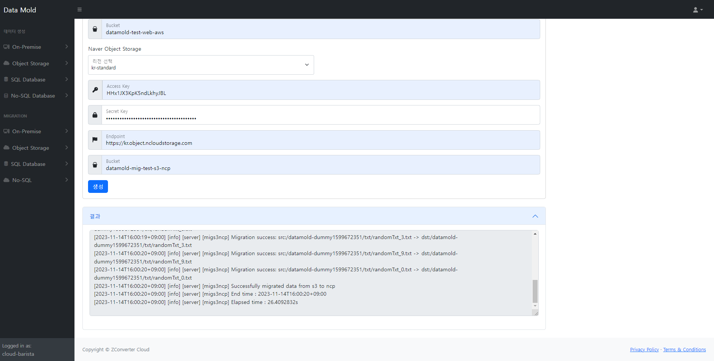
    
    임포트 완료되면 아래의 결과에 작업시간 및 작업내역을 로그를 보여줍니다.
    
7. GCP to Linux
    
    GCP Cloud Storage의 데이터를 Linux로 마이그레이션 하는 화면입니다.
    
    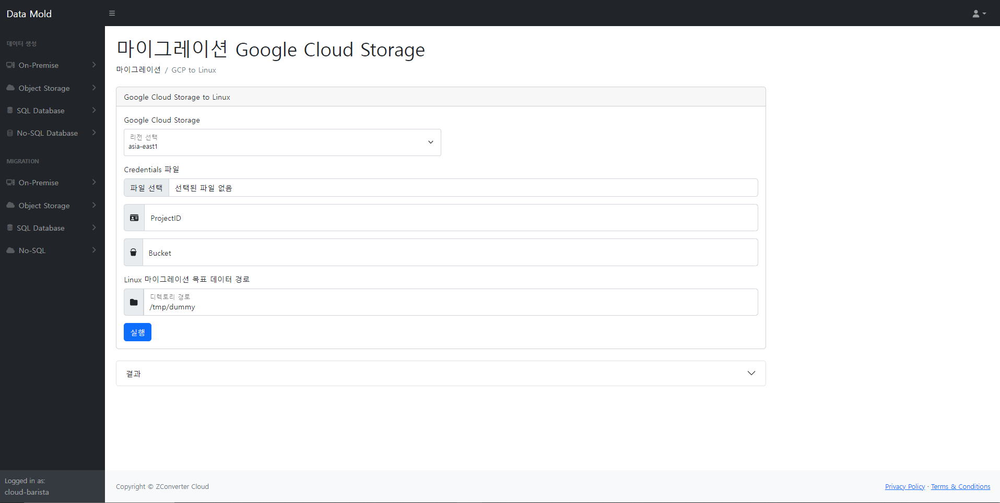
    
    마이그레이션 대상 경로 입력된 경로를 탐색과 GCP Cloud Storage의 오브젝트를 비교 후 변경사항 이 있는 파일을 GCP의 인증정보를 이용하여 Linux로 마이그레이션 합니다.
    
    **GCP Cloud Storage 인증정보 및 버킷**
    - Credentials : GCP에서 발급한 인증정보 json
    - ProjectID : GCP에서 이용할 프로젝트의 ID
    - Region : 이용할 GCP Region
    - Bucket : 마이그레이션 소스 버킷 이름(DNS 호환성 규칙을 따라야 합니다.)
    
    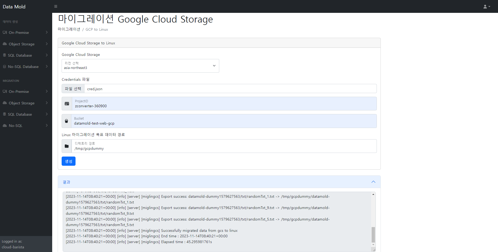
    
    임포트 완료되면 아래의 결과에 작업시간 및 작업내역을 로그를 보여줍니다.
    
8. GCP to AWS S3
    
    GCP Cloud Storage의 데이터를 AWS S3로 마이그레이션 하는 화면입니다.
    
    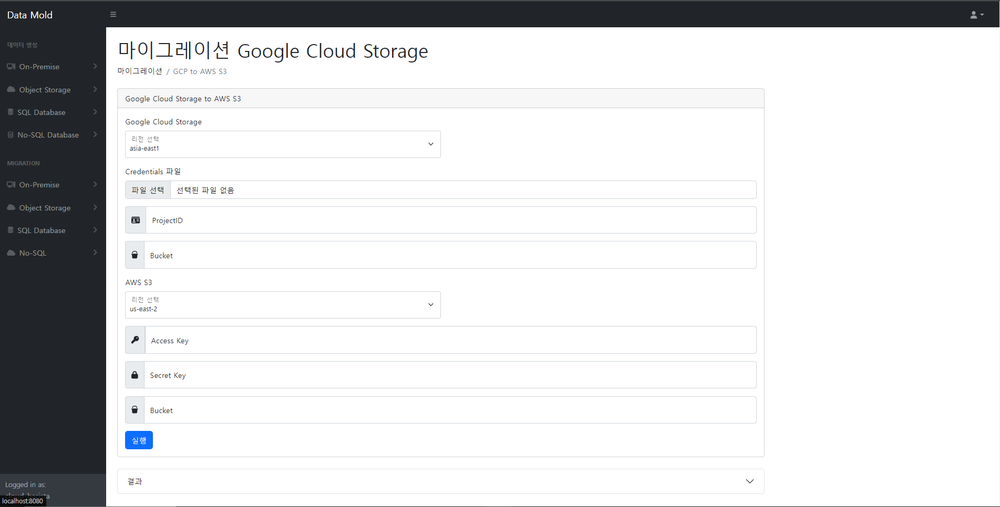
    
    GCP Cloud Storage의 버킷 내 오브젝트와 AWS S3의 오브젝트를 비교 후 변경사항 이 있는 파일을 GCP의 인증정보와 AWS의 인증정보를 이용하여 GCP Cloud Storage에서 AWS S3로 마이그레이션 합니다.
    
    **GCP Cloud Storage 인증정보 및 버킷**
    - Credentials : GCP에서 발급한 인증정보 json
    - ProjectID : GCP에서 이용할 프로젝트의 ID
    - Region : 이용할 GCP Region
    - Bucket : 마이그레이션 소스 버킷 이름(DNS 호환성 규칙을 따라야 합니다.)
    
    **AWS S3 인증정보 및 버킷**
    - AccessKey : AWS에서 발급한 AccessKey
    - SecretKey : AWS에서 발급한 SecretKey
    - Region : 이용할 AWS Region
    - Bucket : 마이그레이션 타겟 버킷 이름(DNS 호환성 규칙을 따라야 합니다.)
    
    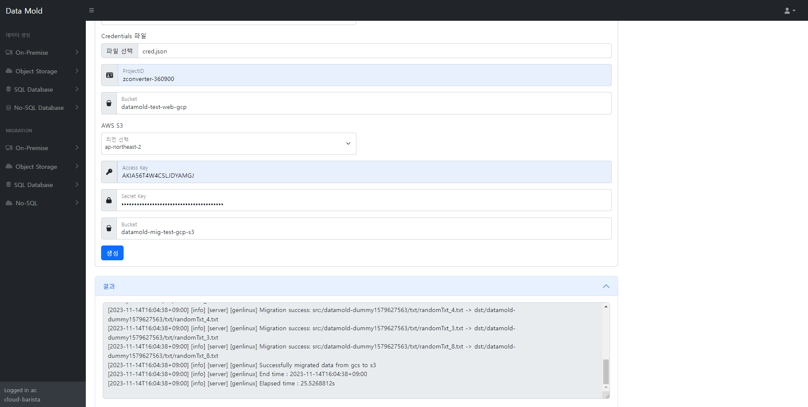
    
    임포트 완료되면 아래의 결과에 작업시간 및 작업내역을 로그를 보여줍니다.
    
9. GCP to NCP
    
    GCP Cloud Storage의 데이터를 NCP Object Storage로 마이그레이션 하는 화면입니다.
    
    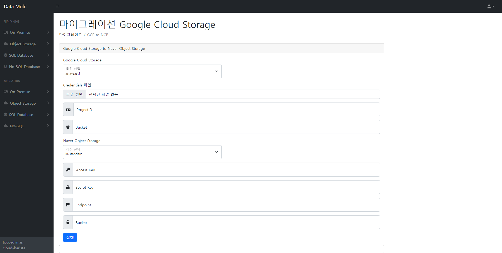
    
    GCP Cloud Storage의 버킷 내 오브젝트와 NCP Object Storage의 오브젝트를 비교 후 변경사항 이 있는 파일을 GCP의 인증정보와 NCP의 인증정보를 이용하여 GCP Cloud Storage에서 NCP Object Storage로 마이그레이션 합니다.
    
    **GCP Cloud Storage 인증정보 및 버킷**
    - Credentials : GCP에서 발급한 인증정보 json
    - ProjectID : GCP에서 이용할 프로젝트의 ID
    - Region : 이용할 GCP Region
    - Bucket : 마이그레이션 소스 버킷 이름(DNS 호환성 규칙을 따라야 합니다.)
    
    **NCP Object Storage인증정보 및 버킷**
    - AccessKey : NCP에서 발급한 AccessKey
    - SecretKey : NCP에서 발급한 SecretKey
    - Endpoint: 사용하고자하는 지역의 [Endpoint](https://api.ncloud-docs.com/docs/common-objectstorageapi-objectstorageapi) 입력
    - Region : 이용할 NCP Region
    - Bucket : 마이그레이션 타겟 버킷 이름(DNS 호환성 규칙을 따라야 합니다.)
    
    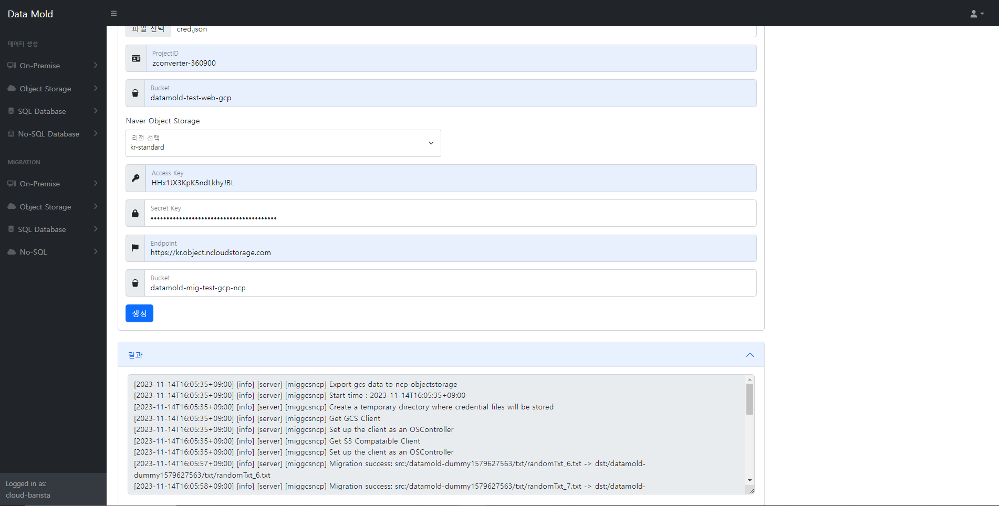
    
    임포트 완료되면 아래의 결과에 작업시간 및 작업내역을 로그를 보여줍니다.
    
10. NCP to Linux
    
    NCP Object Storage의 데이터를 Linux로 마이그레이션 하는 화면입니다.
    
    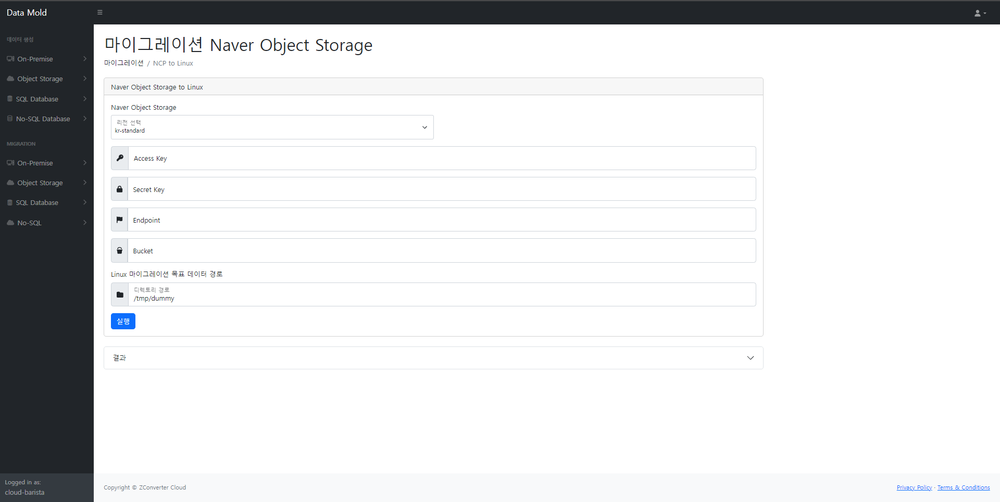
    
    마이그레이션 대상 경로 입력된 경로를 탐색과 NCP Object Storage의 오브젝트를 비교 후 변경사항 이 있는 파일을 NCP의 인증정보를 이용하여 Linux로 마이그레이션 합니다.
    
    **NCP Object Storage인증정보 및 버킷**
    - AccessKey : NCP에서 발급한 AccessKey
    - SecretKey : NCP에서 발급한 SecretKey
    - Endpoint: 사용하고자하는 지역의 [Endpoint](https://api.ncloud-docs.com/docs/common-objectstorageapi-objectstorageapi) 입력
    - Region : 이용할 NCP Region
    - Bucket : 마이그레이션 소스 버킷 이름(DNS 호환성 규칙을 따라야 합니다.)
    
    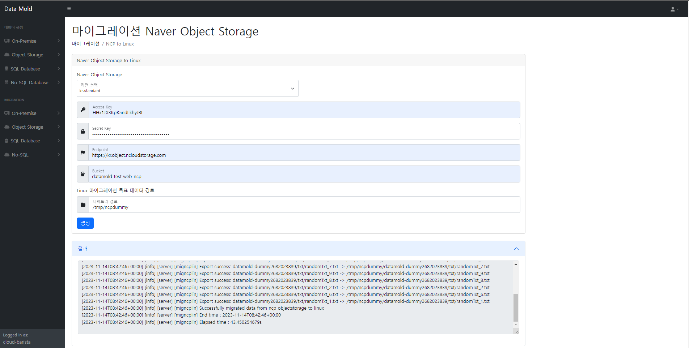
    
    임포트 완료되면 아래의 결과에 작업시간 및 작업내역을 로그를 보여줍니다.
    
11. NCP to AWS S3
    
    NCP Object Storage의 데이터를 AWS S3로 마이그레이션 하는 화면입니다.
    
    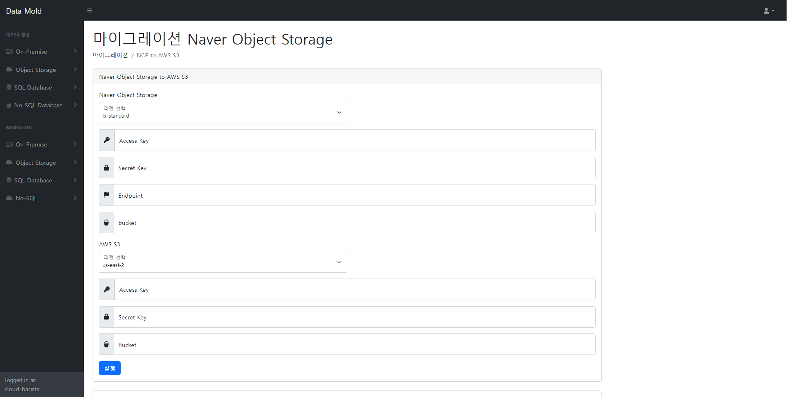
    
    NCP Object Storage의 버킷 내 오브젝트와 AWS S3의 오브젝트를 비교 후 변경사항 이 있는 파일을 NCP의 인증정보와 AWS의 인증정보를 이용하여 NCP Object Storage에서 AWS S3로 마이그레이션 합니다.
    
    **NCP Object Storage인증정보 및 버킷**
    - AccessKey : NCP에서 발급한 AccessKey
    - SecretKey : NCP에서 발급한 SecretKey
    - Endpoint: 사용하고자하는 지역의 [Endpoint](https://api.ncloud-docs.com/docs/common-objectstorageapi-objectstorageapi) 입력
    - Region : 이용할 NCP Region
    - Bucket : 마이그레이션 소스 버킷 이름(DNS 호환성 규칙을 따라야 합니다.)
    
    **AWS S3 인증정보 및 버킷**
    - AccessKey : AWS에서 발급한 AccessKey
    - SecretKey : AWS에서 발급한 SecretKey
    - Region : 이용할 AWS Region
    - Bucket : 마이그레이션 타겟 버킷 이름(DNS 호환성 규칙을 따라야 합니다.)
    
    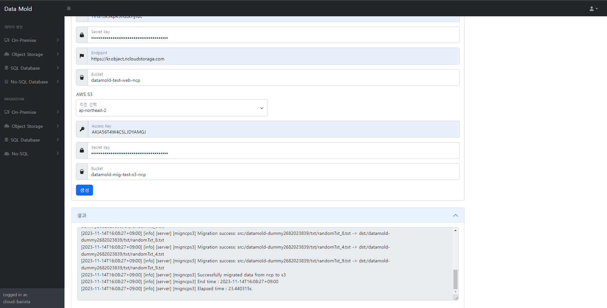
    
    임포트 완료되면 아래의 결과에 작업시간 및 작업내역을 로그를 보여줍니다.
    
12. NCP to GCP
    
    NCP Object Storage의 데이터를 GCP Cloud Storage로 마이그레이션 하는 화면입니다.
    
    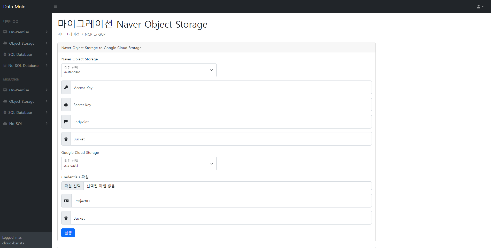
    
    NCP Object Storage의 버킷 내 오브젝트와 GCP Cloud Storage의 오브젝트를 비교 후 변경사항 이 있는 파일을 NCP의 인증정보와 GCP의 인증정보를 이용하여 NCP Object Storage에서 GCP Cloud Storage로 마이그레이션 합니다.
    
    **NCP Object Storage인증정보 및 버킷**
    - AccessKey : NCP에서 발급한 AccessKey
    - SecretKey : NCP에서 발급한 SecretKey
    - Endpoint: 사용하고자하는 지역의 [Endpoint](https://api.ncloud-docs.com/docs/common-objectstorageapi-objectstorageapi) 입력
    - Region : 이용할 NCP Region
    - Bucket : 마이그레이션 소스 버킷 이름(DNS 호환성 규칙을 따라야 합니다.)
    
    **GCP Cloud Storage 인증정보 및 버킷**
    - Credentials : GCP에서 발급한 인증정보 json
    - ProjectID : GCP에서 이용할 프로젝트의 ID
    - Region : 이용할 GCP Region
    - Bucket : 마이그레이션 소스 버킷 이름(DNS 호환성 규칙을 따라야 합니다.)
    
    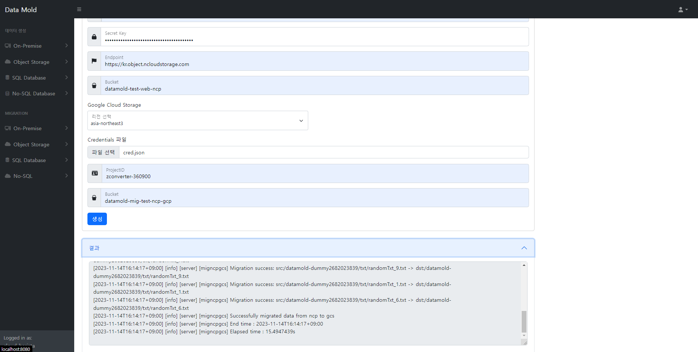
    
    임포트 완료되면 아래의 결과에 작업시간 및 작업내역을 로그를 보여줍니다.
    
13. Mysql to Mysql
    
    Mysql에서 Mysql로 마이그레이션 하는 화면입니다.
    
    해당페이지에서는 AWS,GCP,NCP,On-Premise까지 호환이 됩니다.

    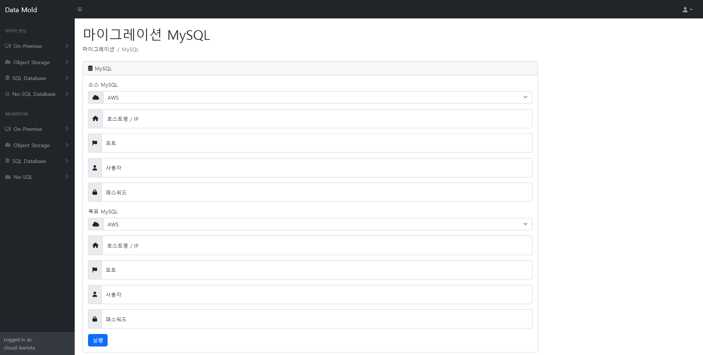

    **On-Premise 인증정보**
    - On-Premise 선택
    - 호스트 명 / IP : On-Premise 호스트 입력
    - 포트 : On-Premise 포트 입력
    - 사용자 : On-Premise 접속 유저이름 입력
    - 패스워드 : 입력한 유저이름의 패스워드 입력

    **AWS RDS mysql 인증정보**
    - AWS 선택
    - 호스트 명 / IP : RDS mysql 생성 시 얻은 공개 endpoint 입력
    - 포트 : RDS mysql 생성 시 얻은 포트 입력
    - 사용자 : RDS mysql 생성 시 설정한 유저이름 입력
    - 패스워드 : RDS mysql 생성 시 설정한 패스워드 입력

    **GCP SQL mysql 인증정보**
    - GCP 선택
    - 호스트 명 / IP : SQL mysql 생성 시 얻은 공개 endpoint 입력
    - 포트 : SQL mysql 생성 시 얻은 포트 입력
    - 사용자 : SQL mysql 생성 시 설정한 유저이름 입력
    - 패스워드 : SQL mysql 생성 시 설정한 패스워드 입력

    **NCP mysql 인증정보**
    - NCP 선택
    - 호스트 명 / IP : NCP mysql 생성 시 얻은 공개 endpoint 입력
    - 포트 : NCP mysql 생성 시 얻은 포트 입력
    - 사용자 : NCP mysql 생성 시 설정한 유저이름 입력
    - 패스워드 : NCP mysql 생성 시 설정한 패스워드 입력
    
    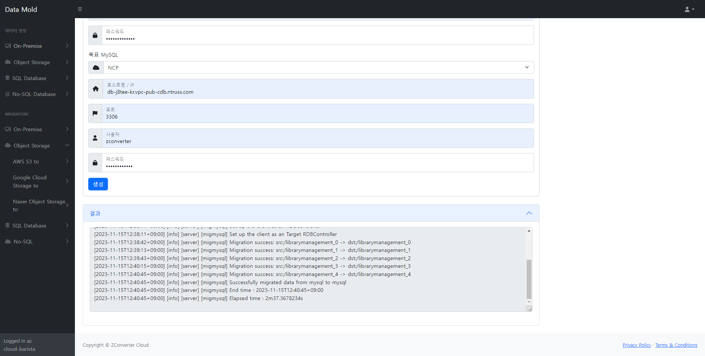
    
    임포트 완료되면 아래의 결과에 작업시간 및 작업내역을 로그를 보여줍니다.
    
14. AWS DynamoDB to GCP FirestoreDB
    
    AWS DynamoDB의 데이터를 GCP FirestoreDB로 마이그레이션 하는 화면입니다.
    
    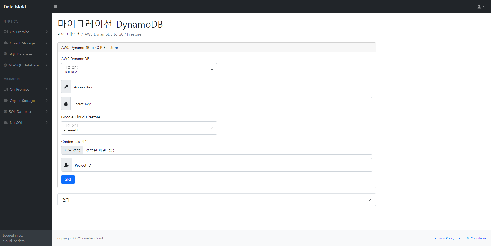
    
    AWS DynamoDB의 테이블들을 AWS의 인증정보와 GCP의 인증정보를 이용하여 AWS DynamoDB에서 GCP FirestoreDB로 마이그레이션 합니다.
    
    **AWS DynamoDB 인증정보 및 버킷**
    - AccessKey : AWS에서 발급한 AccessKey
    - SecretKey : AWS에서 발급한 SecretKey
    - Region : 이용할 AWS Region
    
    **GCP FirestoreDB 인증정보 및 버킷**
    - Credentials : GCP에서 발급한 인증정보 json
    - ProjectID : GCP에서 이용할 프로젝트의 ID
    - Region : 이용할 GCP Region
    
    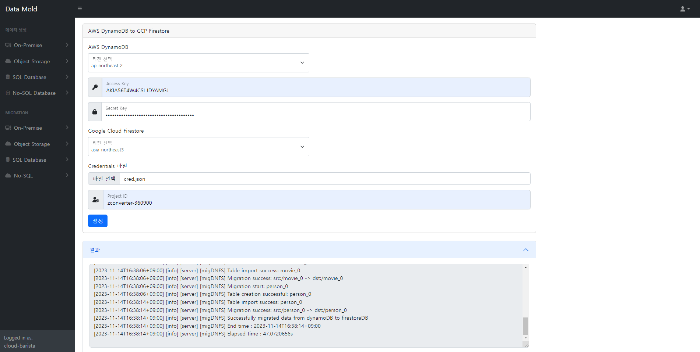
    
    임포트 완료되면 아래의 결과에 작업시간 및 작업내역을 로그를 보여줍니다.
    
15. AWS DynamoDB to NCP MongoDB
    
    AWS DynamoDB의 데이터를 NCP MongoDB로 마이그레이션 하는 화면입니다.
    
    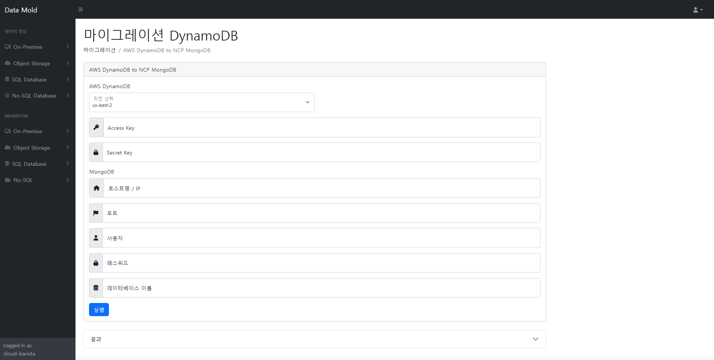
    
    AWS DynamoDB의 테이블들을 AWS의 인증정보와 GCP의 인증정보를 이용하여 AWS DynamoDB에서 NCP MongoDB로 마이그레이션 합니다.
    
    **AWS DynamoDB 인증정보 및 버킷**
    - AccessKey : AWS에서 발급한 AccessKey
    - SecretKey : AWS에서 발급한 SecretKey
    - Region : 이용할 AWS Region
    
    **NCP MongoDB 인증정보**
    - 호스트 명 / IP : NCP MongoDB 생성 시 얻은 공개 endpoint 입력
    - 포트 : NCP MongoDB 생성 시 얻은 포트 입력
    - 사용자 : NCP MongoDB 생성 시 설정한 유저이름 입력
    - 패스워드 : NCP MongoDB 생성 시 설정한 패스워드 입력
    - DBName : MongoDB에서 사용 될 타겟 Database Name
    
    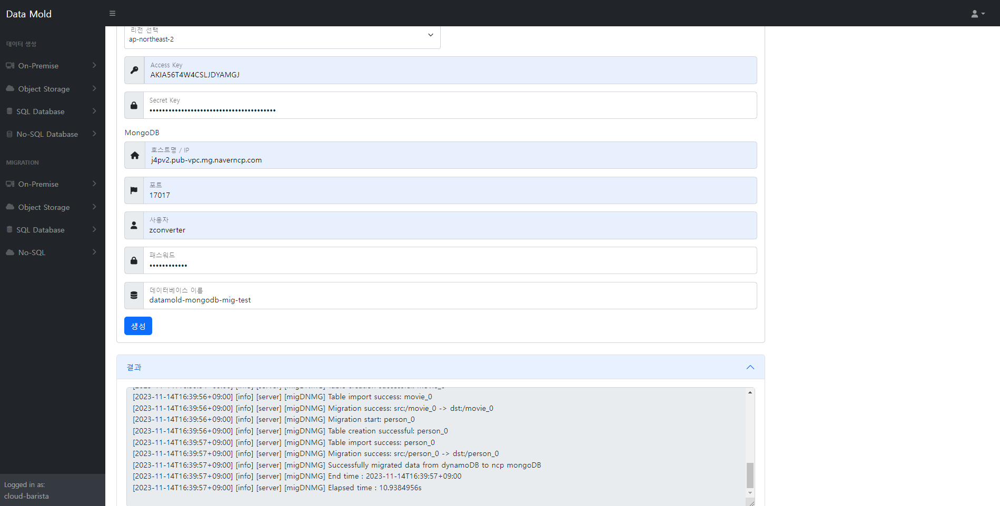
    
    임포트 완료되면 아래의 결과에 작업시간 및 작업내역을 로그를 보여줍니다.
    
16. GCP FirestoreDB to AWS DynamoDB
    
    GCP FirestoreDB의 데이터를 AWS DynamoDB로 마이그레이션 하는 화면입니다.
    
    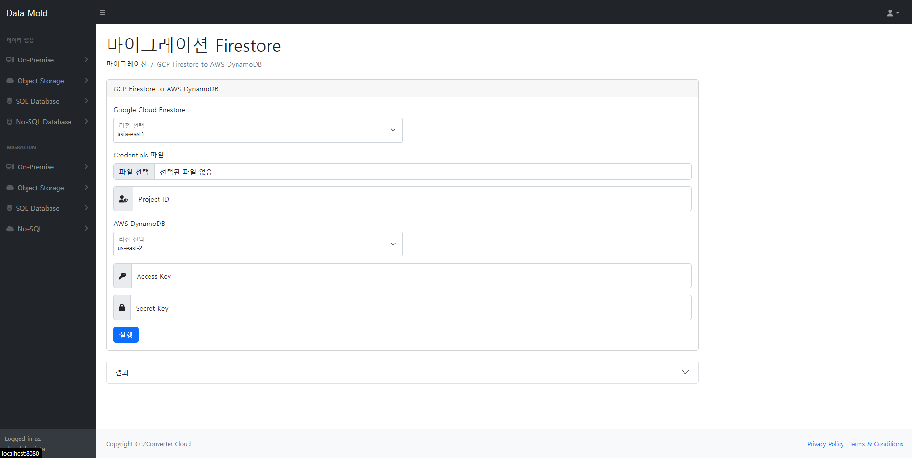
    
    GCP FirestoreDB의 테이블들을 GCP의 인증정보와 AWS의 인증정보를 이용하여 GCP FirestoreDB에서 AWS DynamoDB로 마이그레이션 합니다.
    
    **GCP FirestoreDB 인증정보 및 버킷**
    - Credentials : GCP에서 발급한 인증정보 json
    - ProjectID : GCP에서 이용할 프로젝트의 ID
    - Region : 이용할 GCP Region
    
    **AWS DynamoDB 인증정보 및 버킷**
    - AccessKey : AWS에서 발급한 AccessKey
    - SecretKey : AWS에서 발급한 SecretKey
    - Region : 이용할 AWS Region
    
    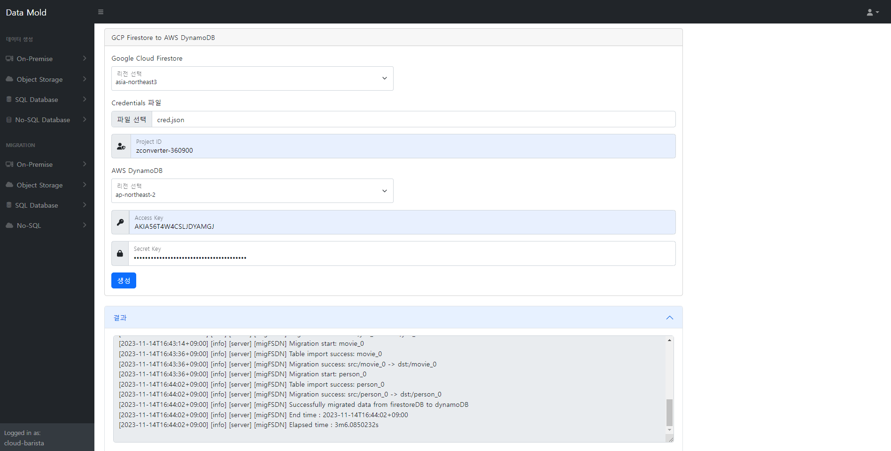
    
    임포트 완료되면 아래의 결과에 작업시간 및 작업내역을 로그를 보여줍니다.
    
17. GCP FirestoreDB to NCP MongoDB
    
    GCP FirestoreDB의 데이터를 NCP MongoDB로 마이그레이션 하는 화면입니다.
    
    
    
    GCP FirestoreDB의 테이블들을 GCP의 인증정보와 NCP의 인증정보를 이용하여 GCP FirestoreDB에서 NCP MongoDB로 마이그레이션 합니다.
    
    **GCP FirestoreDB 인증정보 및 버킷**
    - Credentials : GCP에서 발급한 인증정보 json
    - ProjectID : GCP에서 이용할 프로젝트의 ID
    - Region : 이용할 GCP Region
    
    **NCP MongoDB 인증정보**
    - 호스트 명 / IP : NCP MongoDB 생성 시 얻은 공개 endpoint 입력
    - 포트 : NCP MongoDB 생성 시 얻은 포트 입력
    - 사용자 : NCP MongoDB 생성 시 설정한 유저이름 입력
    - 패스워드 : NCP MongoDB 생성 시 설정한 패스워드 입력
    - DBName : MongoDB에서 사용 될 타겟 Database Name
    
    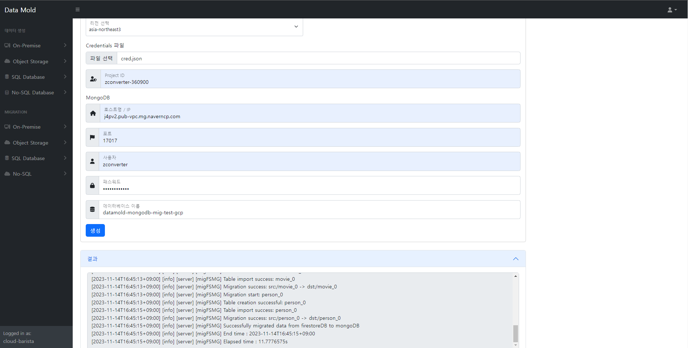
    
    임포트 완료되면 아래의 결과에 작업시간 및 작업내역을 로그를 보여줍니다.
    
18. NCP MongoDB to AWS DynamoDB
    
    NCP MongoDB의 데이터를 AWS DynamoDB로 마이그레이션 하는 화면입니다.
    
    
    
    NCP MongoDB의 테이블들을 NCP의 인증정보와 AWS의 인증정보를 이용하여 NCP MongoDB에서 AWS DynamoDB로 마이그레이션 합니다.
    
    **NCP MongoDB 인증정보**
    - 호스트 명 / IP : NCP MongoDB 생성 시 얻은 공개 endpoint 입력
    - 포트 : NCP MongoDB 생성 시 얻은 포트 입력
    - 사용자 : NCP MongoDB 생성 시 설정한 유저이름 입력
    - 패스워드 : NCP MongoDB 생성 시 설정한 패스워드 입력
    - DBName : MongoDB에서 사용 될 소스 Database Name
    
    **AWS DynamoDB 인증정보**
    - AccessKey : AWS에서 발급한 AccessKey
    - SecretKey : AWS에서 발급한 SecretKey
    - Region : 이용할 AWS Region
    
    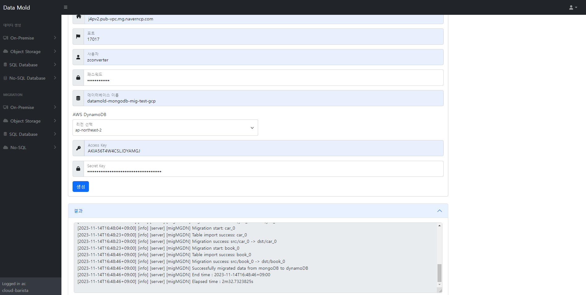
    
    임포트 완료되면 아래의 결과에 작업시간 및 작업내역을 로그를 보여줍니다.
    
19. NCP MongoDB to GCP FirestoreDB
    
    NCP MongoDB의 데이터를 GCP FirestoreDB로 마이그레이션 하는 화면입니다.
    
    
    
    NCP MongoDB의 테이블들을 NCP의 인증정보와 GCP의 인증정보를 이용하여 NCP MongoDB에서 GCP FirestoreDB로 마이그레이션 합니다.
    
    **NCP MongoDB 인증정보**
    - 호스트 명 / IP : NCP MongoDB 생성 시 얻은 공개 endpoint 입력
    - 포트 : NCP MongoDB 생성 시 얻은 포트 입력
    - 사용자 : NCP MongoDB 생성 시 설정한 유저이름 입력
    - 패스워드 : NCP MongoDB 생성 시 설정한 패스워드 입력
    - DBName : MongoDB에서 사용 될 소스 Database Name
    
    **GCP FirestoreDB 인증정보**
    - Credentials : GCP에서 발급한 인증정보 json
    - ProjectID : GCP에서 이용할 프로젝트의 ID
    - Region : 이용할 GCP Region
    
    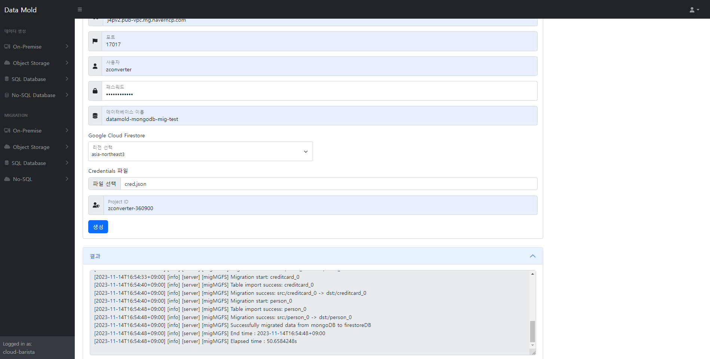
    
    임포트 완료되면 아래의 결과에 작업시간 및 작업내역을 로그를 보여줍니다.
